# A3 Geometry Manual Review

| scenario_id | case_id | review_status | scene_debug_valid | los_rays | has_target_bounce_n2 | rays_topk_n | scene_debug_issues |
| --- | --- | --- | --- | --- | --- | --- | --- |
| A3 | 0 | PASS | 1 | 0 | 1 | 2 |  |
| A3 | 1 | PASS | 1 | 0 | 1 | 2 |  |
| A3 | 10 | PASS | 1 | 0 | 1 | 2 |  |
| A3 | 11 | PASS | 1 | 0 | 1 | 2 |  |
| A3 | 12 | PASS | 1 | 0 | 1 | 2 |  |
| A3 | 13 | PASS | 1 | 0 | 1 | 2 |  |
| A3 | 14 | PASS | 1 | 0 | 1 | 2 |  |
| A3 | 15 | PASS | 1 | 0 | 1 | 2 |  |
| A3 | 16 | PASS | 1 | 0 | 1 | 2 |  |
| A3 | 17 | PASS | 1 | 0 | 1 | 2 |  |
| A3 | 18 | PASS | 1 | 0 | 1 | 2 |  |
| A3 | 19 | PASS | 1 | 0 | 1 | 2 |  |
| A3 | 2 | PASS | 1 | 0 | 1 | 2 |  |
| A3 | 20 | PASS | 1 | 0 | 1 | 2 |  |
| A3 | 21 | PASS | 1 | 0 | 1 | 2 |  |
| A3 | 22 | PASS | 1 | 0 | 1 | 2 |  |
| A3 | 23 | PASS | 1 | 0 | 1 | 2 |  |
| A3 | 3 | PASS | 1 | 0 | 1 | 2 |  |
| A3 | 4 | PASS | 1 | 0 | 1 | 2 |  |
| A3 | 5 | PASS | 1 | 0 | 1 | 2 |  |

## Case 0

- review_status: **PASS**
- scene_debug_json: `/Users/kimmyoungsun/Documents/codex/outputs/step1_diag/A3_tuned/scene_debug/A3__0__scene_debug.json`

## Case 1

- review_status: **PASS**
- scene_debug_json: `/Users/kimmyoungsun/Documents/codex/outputs/step1_diag/A3_tuned/scene_debug/A3__1__scene_debug.json`
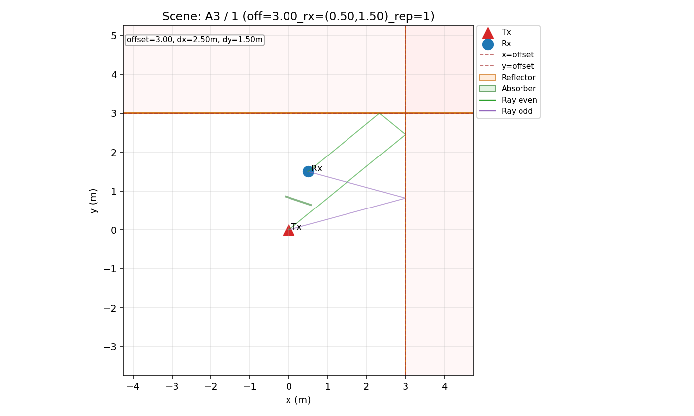

## Case 10

- review_status: **PASS**
- scene_debug_json: `/Users/kimmyoungsun/Documents/codex/outputs/step1_diag/A3_tuned/scene_debug/A3__10__scene_debug.json`
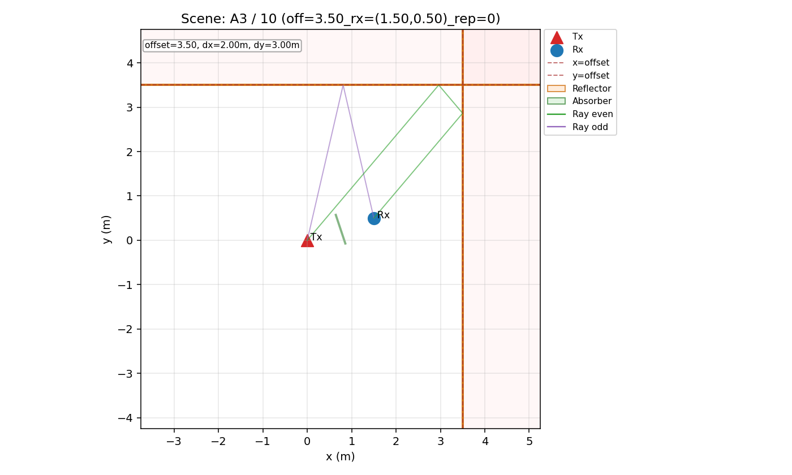

## Case 11

- review_status: **PASS**
- scene_debug_json: `/Users/kimmyoungsun/Documents/codex/outputs/step1_diag/A3_tuned/scene_debug/A3__11__scene_debug.json`

## Case 12

- review_status: **PASS**
- scene_debug_json: `/Users/kimmyoungsun/Documents/codex/outputs/step1_diag/A3_tuned/scene_debug/A3__12__scene_debug.json`
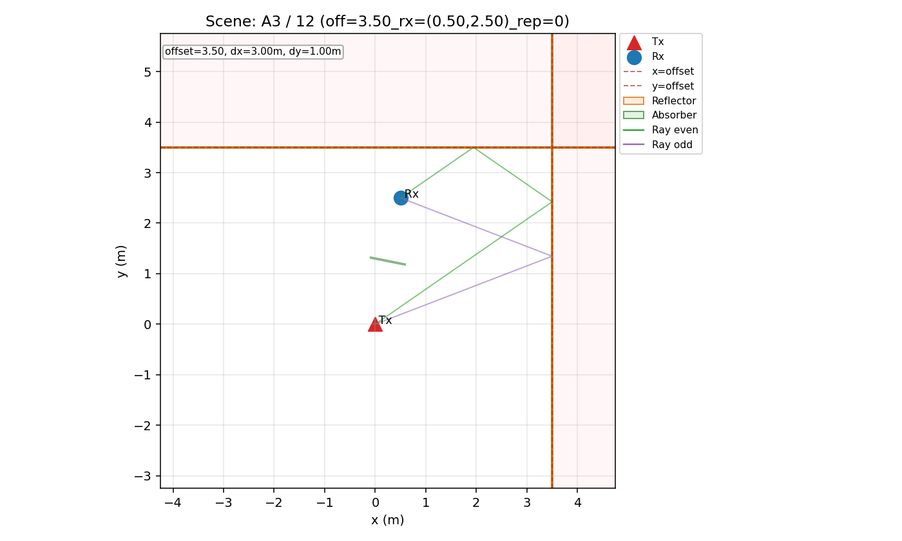

## Case 13

- review_status: **PASS**
- scene_debug_json: `/Users/kimmyoungsun/Documents/codex/outputs/step1_diag/A3_tuned/scene_debug/A3__13__scene_debug.json`

## Case 14

- review_status: **PASS**
- scene_debug_json: `/Users/kimmyoungsun/Documents/codex/outputs/step1_diag/A3_tuned/scene_debug/A3__14__scene_debug.json`
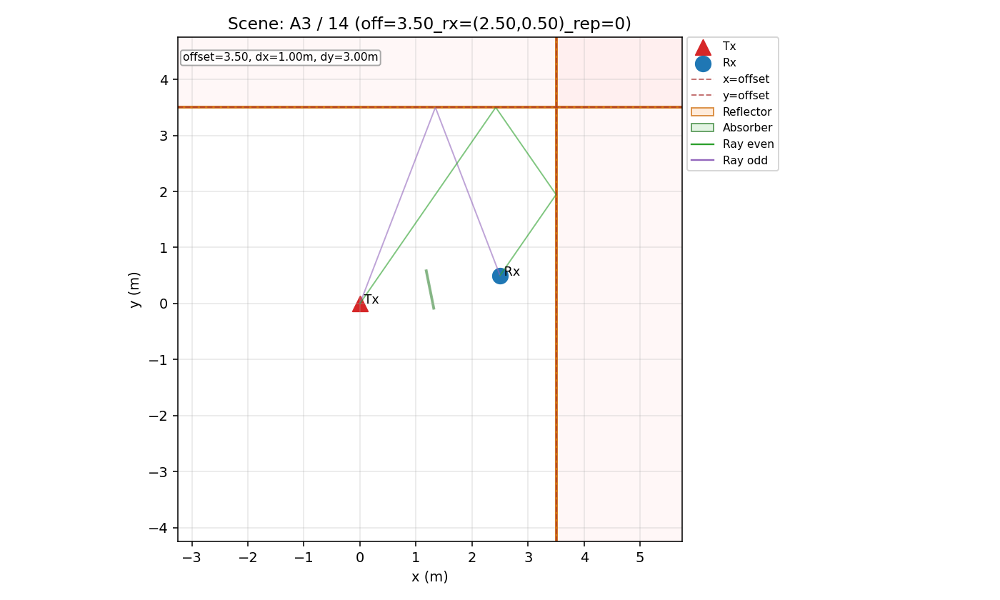

## Case 15

- review_status: **PASS**
- scene_debug_json: `/Users/kimmyoungsun/Documents/codex/outputs/step1_diag/A3_tuned/scene_debug/A3__15__scene_debug.json`

## Case 16

- review_status: **PASS**
- scene_debug_json: `/Users/kimmyoungsun/Documents/codex/outputs/step1_diag/A3_tuned/scene_debug/A3__16__scene_debug.json`
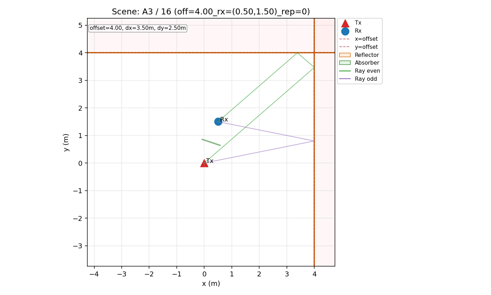

## Case 17

- review_status: **PASS**
- scene_debug_json: `/Users/kimmyoungsun/Documents/codex/outputs/step1_diag/A3_tuned/scene_debug/A3__17__scene_debug.json`
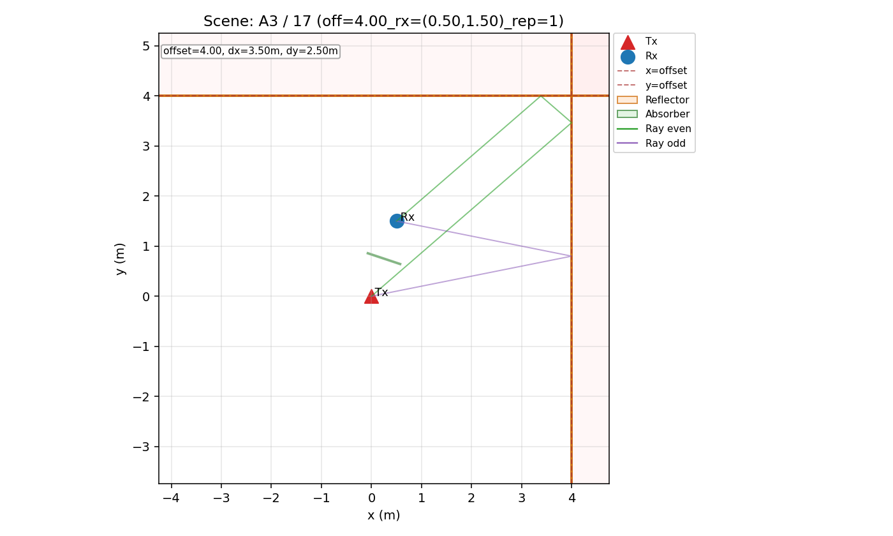

## Case 18

- review_status: **PASS**
- scene_debug_json: `/Users/kimmyoungsun/Documents/codex/outputs/step1_diag/A3_tuned/scene_debug/A3__18__scene_debug.json`
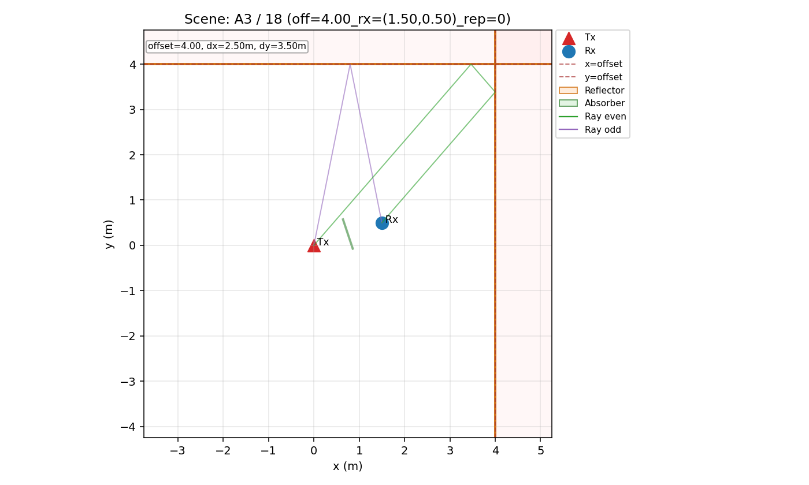

## Case 19

- review_status: **PASS**
- scene_debug_json: `/Users/kimmyoungsun/Documents/codex/outputs/step1_diag/A3_tuned/scene_debug/A3__19__scene_debug.json`

## Case 2

- review_status: **PASS**
- scene_debug_json: `/Users/kimmyoungsun/Documents/codex/outputs/step1_diag/A3_tuned/scene_debug/A3__2__scene_debug.json`

## Case 20

- review_status: **PASS**
- scene_debug_json: `/Users/kimmyoungsun/Documents/codex/outputs/step1_diag/A3_tuned/scene_debug/A3__20__scene_debug.json`

## Case 21

- review_status: **PASS**
- scene_debug_json: `/Users/kimmyoungsun/Documents/codex/outputs/step1_diag/A3_tuned/scene_debug/A3__21__scene_debug.json`
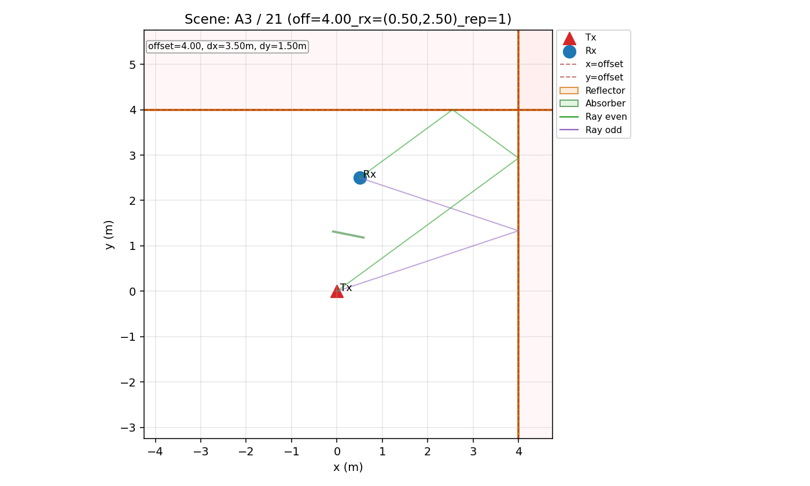

## Case 22

- review_status: **PASS**
- scene_debug_json: `/Users/kimmyoungsun/Documents/codex/outputs/step1_diag/A3_tuned/scene_debug/A3__22__scene_debug.json`
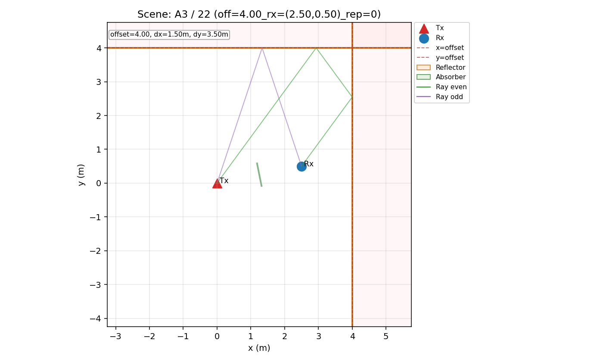

## Case 23

- review_status: **PASS**
- scene_debug_json: `/Users/kimmyoungsun/Documents/codex/outputs/step1_diag/A3_tuned/scene_debug/A3__23__scene_debug.json`

## Case 3

- review_status: **PASS**
- scene_debug_json: `/Users/kimmyoungsun/Documents/codex/outputs/step1_diag/A3_tuned/scene_debug/A3__3__scene_debug.json`
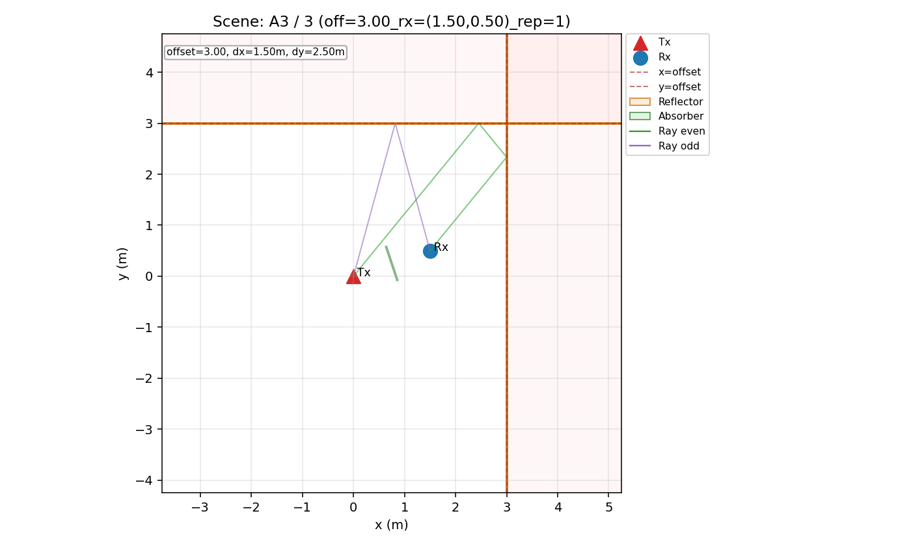

## Case 4

- review_status: **PASS**
- scene_debug_json: `/Users/kimmyoungsun/Documents/codex/outputs/step1_diag/A3_tuned/scene_debug/A3__4__scene_debug.json`
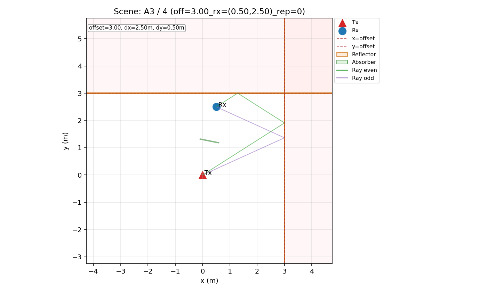

## Case 5

- review_status: **PASS**
- scene_debug_json: `/Users/kimmyoungsun/Documents/codex/outputs/step1_diag/A3_tuned/scene_debug/A3__5__scene_debug.json`

