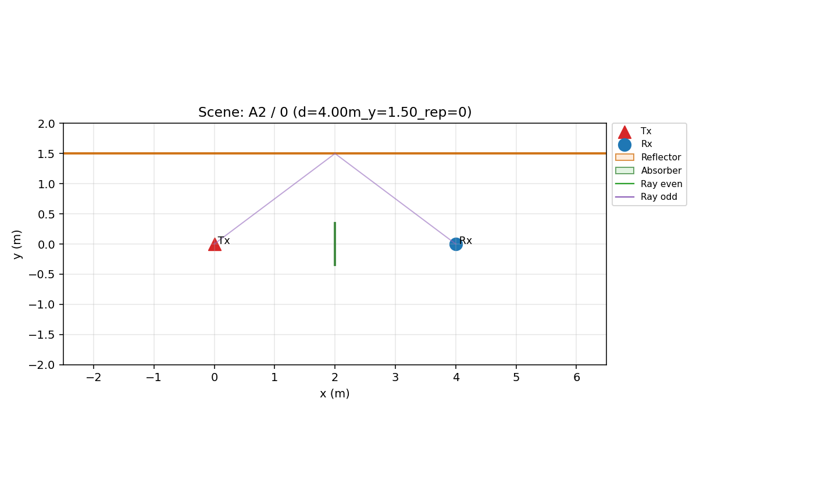
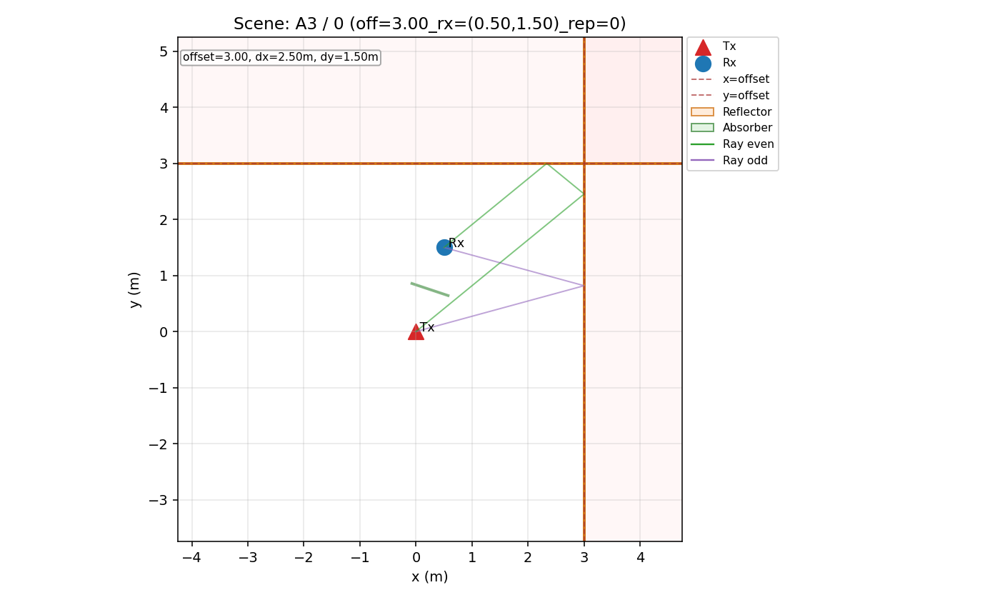
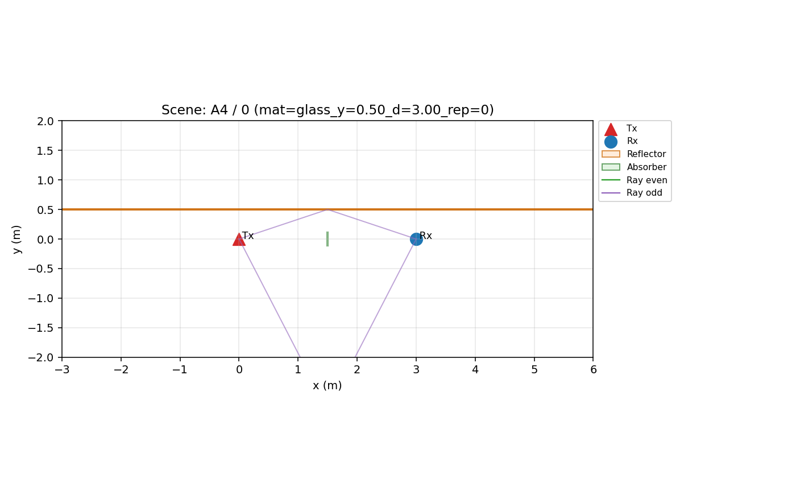
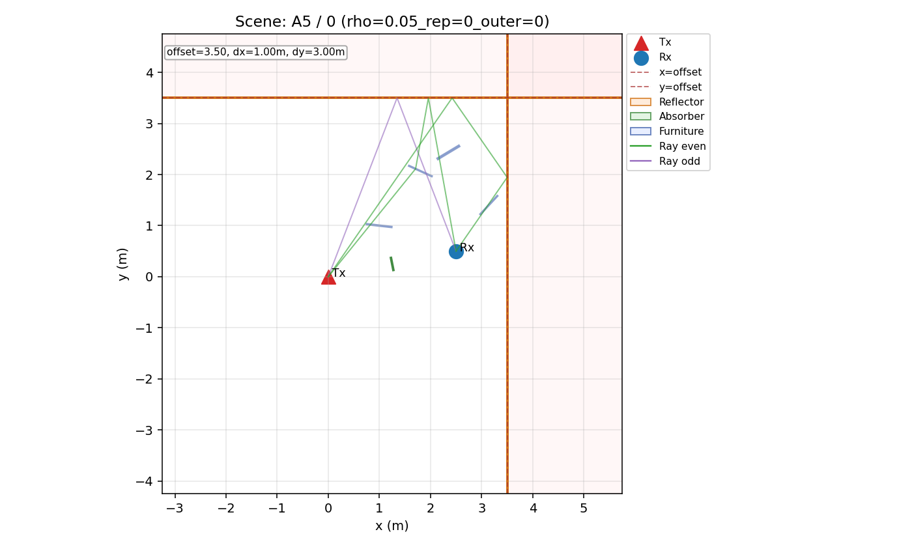
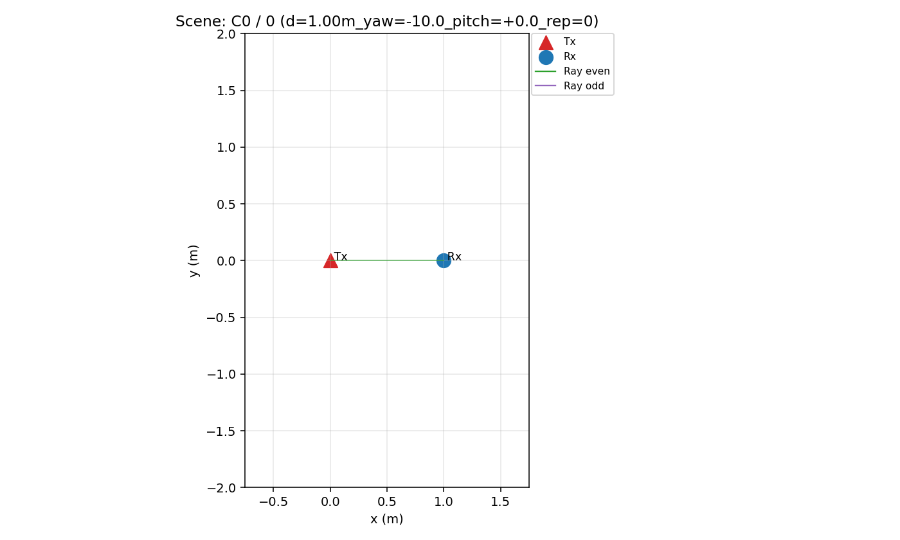

# Intermediate Report (tmp_c2_apply_20260301)

## Proposition Status

| proposition | status | data_status | definition |
| --- | --- | --- | --- |
| M1 | SUPPORTED | OK | C0 floor distance/yaw sensitivity |
| M2 | SUPPORTED | OK | Fraction inside/outside floor uncertainty band |
| G1 | SUPPORTED | OK | A2 odd-bounce increases cross dominance vs C0 |
| G2 | SUPPORTED | OK | A3 even-bounce recovery vs A2 |
| L1 | SUPPORTED | OK | Early/Late leakage separation via XPD_early_ex/XPD_late_ex/L_pol |
| L2 | SUPPORTED | OK | A5 stress impact on center/tails |
| L3 | PARTIAL | OK | Correlation between leakage excess and -EL_proxy |
| R1 | SUPPORTED | OK | Room-space LOS/NLOS and heatmap consistency |
| R2 | SUPPORTED | OK | DS/early-fraction relation with leakage |
| P1 | SUPPORTED | OK | Two-stage model (EL first, then mechanism effects) vs constant baseline |
| P2 | SUPPORTED | OK | Stage-1 EL coefficient sign stability under subsampling |

## M1

- Definition: C0 floor distance/yaw sensitivity
- Status: **SUPPORTED**
- Details: `{"definition": "C0 floor distance/yaw sensitivity", "n": 30, "trend": {"slope": -0.09401464052724587, "intercept": 24.978348288745664, "r": -0.05736274922277541, "p": 0.7633486841782926, "n": 30}, "variance_decomp": {"n": 30, "distance_group_var": 0.05763991688281151, "yaw_group_var": 0.022595997331414992, "dominant": "distance"}, "status": "SUPPORTED"}`

## M2

- Definition: Fraction inside/outside floor uncertainty band
- Status: **SUPPORTED**
- Details: `{"definition": "Fraction inside/outside floor uncertainty band", "inside_ratio": 0.07238605898123325, "outside_ratio": 0.9276139410187667, "status": "SUPPORTED"}`

## G1

- Definition: A2 odd-bounce increases cross dominance vs C0
- Status: **SUPPORTED**
- Details: `{"definition": "A2 odd-bounce increases cross dominance vs C0", "delta_median_db": -32.934837404558046, "ks_wasserstein": {"ks_stat": 1.0, "ks_p": 1.4253754280521992e-16, "wasserstein": 32.93925328231725}, "status": "SUPPORTED"}`

## G2

- Definition: A3 even-bounce recovery vs A2
- Status: **SUPPORTED**
- Details: `{"definition": "A3 even-bounce recovery vs A2", "delta_median_db": 3.4895295726365383, "ks_wasserstein": {"ks_stat": 0.5, "ks_p": 0.001953604031784197, "wasserstein": 3.616896084596988}, "status": "SUPPORTED"}`

## L1

- Definition: Early/Late leakage separation via XPD_early_ex/XPD_late_ex/L_pol
- Status: **SUPPORTED**
- Details: `{"definition": "Early/Late leakage separation via XPD_early_ex/XPD_late_ex/L_pol", "median_early_ex_db": -31.36231200502684, "median_late_ex_db": -24.93483769676745, "median_lpol_db": -7.999999589782957, "status": "SUPPORTED"}`

## L2

- Definition: A5 stress impact on center/tails
- Status: **SUPPORTED**
- Details: `{"definition": "A5 stress impact on center/tails", "base": {"n": 30, "mean": -19.032027097874245, "std": 0.6584136378266066, "p5": -19.940151240653133, "p10": -19.69815300994449, "p90": -18.169538582237376, "p95": -17.985773124176053}, "stress": {"n": 30, "mean": -25.05446358747018, "std": 1.232900081263948, "p5": -27.17300937281377, "p10": -26.86748119410372, "p90": -23.976145634559987, "p95": -23.648862808698272}, "delta_mean_db": -6.022436489595936, "var_ratio": 1.872531202928443, "status": "SUPPORTED"}`

## L3

- Definition: Correlation between leakage excess and -EL_proxy
- Status: **PARTIAL**
- Details: `{"definition": "Correlation between leakage excess and -EL_proxy", "spearman": {"rho": 0.1687309780844257, "p": 0.0017395116529412304, "ci_lo": 0.056503791850099204, "ci_hi": 0.26688767499108423, "n": 342}, "status": "PARTIAL"}`

## R1

- Definition: Room-space LOS/NLOS and heatmap consistency
- Status: **SUPPORTED**
- Details: `{"definition": "Room-space LOS/NLOS and heatmap consistency", "n_b_rows": 161, "n_los": 126, "n_nlos": 35, "ks_wasserstein": {"ks_stat": 0.5348571428571428, "ks_p": 9.543117557995215e-08, "wasserstein": 4.808748263731411}, "status": "SUPPORTED"}`

## R2

- Definition: DS/early-fraction relation with leakage
- Status: **SUPPORTED**
- Details: `{"definition": "DS/early-fraction relation with leakage", "spearman_ds_vs_xpd": {"rho": -0.24796665315542266, "p": 0.0002247235468931729, "ci_lo": -0.3806075403658744, "ci_hi": -0.11189996248409197, "n": 217}, "status": "SUPPORTED"}`

## P1

- Definition: Two-stage model (EL first, then mechanism effects) vs constant baseline
- Status: **SUPPORTED**
- Details: `{"definition": "Two-stage model (EL first, then mechanism effects) vs constant baseline", "cv_two_stage": {"n_stage1": 256, "n_stage2": 342, "b1_el": -0.08465971930043258, "rmse_const": 4.5254316398707255, "rmse_lin": 3.6724274114925834, "nll_const": 2.927426715328338, "nll_lin": 2.718733953951605}, "cv_one_shot_reference": {"n": 342, "rmse_const": 4.592429606476808, "rmse_lin": 3.997322602808709, "nll_const": 2.942056132523816, "nll_lin": 2.8037279600459164}, "status": "SUPPORTED"}`

## P2

- Definition: Stage-1 EL coefficient sign stability under subsampling
- Status: **SUPPORTED**
- Details: `{"definition": "Stage-1 EL coefficient sign stability under subsampling", "subset": ["A3", "A4", "B1", "B2", "B3"], "stability": {"n": 256, "base_sign": -1.0, "sign_keep_rate": 0.93}, "status": "SUPPORTED"}`

## Scenario Sections

### A2

- 의미: LOS-blocked single-bounce(odd) control to probe early cross-leakage increase.

### A3

- 의미: LOS-blocked double-bounce(even) control to test co-dominant recovery trend.

### A4

- 의미: LOS-blocked material/angle sweep to isolate material-conditional leakage statistics.

### A5

- 의미: LOS-blocked depolarization-stress scenario (roughness/human/scatter) for tail-risk.

### B1

- 의미: Room grid baseline (mostly LOS) for spatial Z/U trend mapping.

- [A2A3__ALL__lpol_box.png](figures/A2A3__ALL__lpol_box.png)
- [A2A3C0__ALL__xpd_early_ex_cdf.png](figures/A2A3C0__ALL__xpd_early_ex_cdf.png)
- [ALL__early_late_ex_box.png](figures/ALL__early_late_ex_box.png)
- [A5__ALL__base_vs_stress_xpd_early_ex_cdf.png](figures/A5__ALL__base_vs_stress_xpd_early_ex_cdf.png)
- [ALL__xpd_early_ex_vs_el_proxy.png](figures/ALL__xpd_early_ex_vs_el_proxy.png)
- [C0__ALL__xpd_floor_vs_logd.png](figures/C0__ALL__xpd_floor_vs_logd.png)
- [C0__ALL__xpd_floor_vs_yaw.png](figures/C0__ALL__xpd_floor_vs_yaw.png)
- [B__ALL__heatmap_lpol.png](figures/B__ALL__heatmap_lpol.png)
- [B__ALL__heatmap_xpd_early_ex.png](figures/B__ALL__heatmap_xpd_early_ex.png)
- [B__ALL__los_nlos_xpd_ex_cdf.png](figures/B__ALL__los_nlos_xpd_ex_cdf.png)
- [ALL__ds_vs_xpd_early_ex.png](figures/ALL__ds_vs_xpd_early_ex.png)
- [ALL__early_fraction_vs_rho.png](figures/ALL__early_fraction_vs_rho.png)

### B2

- 의미: Room grid with partition obstacle to induce partial NLOS/blocked regions.

- [A2A3__ALL__lpol_box.png](figures/A2A3__ALL__lpol_box.png)
- [A2A3C0__ALL__xpd_early_ex_cdf.png](figures/A2A3C0__ALL__xpd_early_ex_cdf.png)
- [ALL__early_late_ex_box.png](figures/ALL__early_late_ex_box.png)
- [A5__ALL__base_vs_stress_xpd_early_ex_cdf.png](figures/A5__ALL__base_vs_stress_xpd_early_ex_cdf.png)
- [ALL__xpd_early_ex_vs_el_proxy.png](figures/ALL__xpd_early_ex_vs_el_proxy.png)
- [C0__ALL__xpd_floor_vs_logd.png](figures/C0__ALL__xpd_floor_vs_logd.png)
- [C0__ALL__xpd_floor_vs_yaw.png](figures/C0__ALL__xpd_floor_vs_yaw.png)
- [B__ALL__heatmap_lpol.png](figures/B__ALL__heatmap_lpol.png)
- [B__ALL__heatmap_xpd_early_ex.png](figures/B__ALL__heatmap_xpd_early_ex.png)
- [B__ALL__los_nlos_xpd_ex_cdf.png](figures/B__ALL__los_nlos_xpd_ex_cdf.png)
- [ALL__ds_vs_xpd_early_ex.png](figures/ALL__ds_vs_xpd_early_ex.png)
- [ALL__early_fraction_vs_rho.png](figures/ALL__early_fraction_vs_rho.png)

### B3

- 의미: Room grid with corner obstacles for stronger NLOS and multipath complexity.

- [A2A3__ALL__lpol_box.png](figures/A2A3__ALL__lpol_box.png)
- [A2A3C0__ALL__xpd_early_ex_cdf.png](figures/A2A3C0__ALL__xpd_early_ex_cdf.png)
- [ALL__early_late_ex_box.png](figures/ALL__early_late_ex_box.png)
- [A5__ALL__base_vs_stress_xpd_early_ex_cdf.png](figures/A5__ALL__base_vs_stress_xpd_early_ex_cdf.png)
- [ALL__xpd_early_ex_vs_el_proxy.png](figures/ALL__xpd_early_ex_vs_el_proxy.png)
- [C0__ALL__xpd_floor_vs_logd.png](figures/C0__ALL__xpd_floor_vs_logd.png)
- [C0__ALL__xpd_floor_vs_yaw.png](figures/C0__ALL__xpd_floor_vs_yaw.png)
- [B__ALL__heatmap_lpol.png](figures/B__ALL__heatmap_lpol.png)
- [B__ALL__heatmap_xpd_early_ex.png](figures/B__ALL__heatmap_xpd_early_ex.png)
- [B__ALL__los_nlos_xpd_ex_cdf.png](figures/B__ALL__los_nlos_xpd_ex_cdf.png)
- [ALL__ds_vs_xpd_early_ex.png](figures/ALL__ds_vs_xpd_early_ex.png)
- [ALL__early_fraction_vs_rho.png](figures/ALL__early_fraction_vs_rho.png)

### C0

- 의미: Free-space LOS calibration baseline for floor/alignment uncertainty.

## WARN

- scene_debug missing: B1/0 -> fallback layout used
- scene_debug missing: B1/1 -> fallback layout used
- scene_debug missing: B1/10 -> fallback layout used
- scene_debug missing: B1/11 -> fallback layout used
- scene_debug missing: B1/12 -> fallback layout used
- scene_debug missing: B1/13 -> fallback layout used
- scene_debug missing: B1/14 -> fallback layout used
- scene_debug missing: B1/15 -> fallback layout used
- scene_debug missing: B1/16 -> fallback layout used
- scene_debug missing: B1/17 -> fallback layout used
- scene_debug missing: B1/18 -> fallback layout used
- scene_debug missing: B1/19 -> fallback layout used
- scene_debug missing: B1/2 -> fallback layout used
- scene_debug missing: B1/20 -> fallback layout used
- scene_debug missing: B1/21 -> fallback layout used
- scene_debug missing: B1/22 -> fallback layout used
- scene_debug missing: B1/23 -> fallback layout used
- scene_debug missing: B1/24 -> fallback layout used
- scene_debug missing: B1/25 -> fallback layout used
- scene_debug missing: B1/26 -> fallback layout used
- scene_debug missing: B1/27 -> fallback layout used
- scene_debug missing: B1/28 -> fallback layout used
- scene_debug missing: B1/29 -> fallback layout used
- scene_debug missing: B1/3 -> fallback layout used
- scene_debug missing: B1/30 -> fallback layout used
- scene_debug missing: B1/31 -> fallback layout used
- scene_debug missing: B1/32 -> fallback layout used
- scene_debug missing: B1/33 -> fallback layout used
- scene_debug missing: B1/34 -> fallback layout used
- scene_debug missing: B1/35 -> fallback layout used
- scene_debug missing: B1/36 -> fallback layout used
- scene_debug missing: B1/37 -> fallback layout used
- scene_debug missing: B1/38 -> fallback layout used
- scene_debug missing: B1/39 -> fallback layout used
- scene_debug missing: B1/4 -> fallback layout used
- scene_debug missing: B1/40 -> fallback layout used
- scene_debug missing: B1/41 -> fallback layout used
- scene_debug missing: B1/42 -> fallback layout used
- scene_debug missing: B1/43 -> fallback layout used
- scene_debug missing: B1/44 -> fallback layout used
- scene_debug missing: B1/45 -> fallback layout used
- scene_debug missing: B1/46 -> fallback layout used
- scene_debug missing: B1/47 -> fallback layout used
- scene_debug missing: B1/48 -> fallback layout used
- scene_debug missing: B1/49 -> fallback layout used
- scene_debug missing: B1/5 -> fallback layout used
- scene_debug missing: B1/50 -> fallback layout used
- scene_debug missing: B1/51 -> fallback layout used
- scene_debug missing: B1/52 -> fallback layout used
- scene_debug missing: B1/53 -> fallback layout used
- scene_debug missing: B1/54 -> fallback layout used
- scene_debug missing: B1/55 -> fallback layout used
- scene_debug missing: B1/56 -> fallback layout used
- scene_debug missing: B1/57 -> fallback layout used
- scene_debug missing: B1/58 -> fallback layout used
- scene_debug missing: B1/59 -> fallback layout used
- scene_debug missing: B1/6 -> fallback layout used
- scene_debug missing: B1/60 -> fallback layout used
- scene_debug missing: B1/61 -> fallback layout used
- scene_debug missing: B1/62 -> fallback layout used
- scene_debug missing: B1/7 -> fallback layout used
- scene_debug missing: B1/8 -> fallback layout used
- scene_debug missing: B1/9 -> fallback layout used
- scene_debug missing: B2/0 -> fallback layout used
- scene_debug missing: B2/1 -> fallback layout used
- scene_debug missing: B2/10 -> fallback layout used
- scene_debug missing: B2/11 -> fallback layout used
- scene_debug missing: B2/12 -> fallback layout used
- scene_debug missing: B2/13 -> fallback layout used
- scene_debug missing: B2/14 -> fallback layout used
- scene_debug missing: B2/15 -> fallback layout used
- scene_debug missing: B2/16 -> fallback layout used
- scene_debug missing: B2/17 -> fallback layout used
- scene_debug missing: B2/18 -> fallback layout used
- scene_debug missing: B2/19 -> fallback layout used
- scene_debug missing: B2/2 -> fallback layout used
- scene_debug missing: B2/20 -> fallback layout used
- scene_debug missing: B2/21 -> fallback layout used
- scene_debug missing: B2/22 -> fallback layout used
- scene_debug missing: B2/23 -> fallback layout used
- scene_debug missing: B2/24 -> fallback layout used
- scene_debug missing: B2/25 -> fallback layout used
- scene_debug missing: B2/26 -> fallback layout used
- scene_debug missing: B2/27 -> fallback layout used
- scene_debug missing: B2/28 -> fallback layout used
- scene_debug missing: B2/29 -> fallback layout used
- scene_debug missing: B2/3 -> fallback layout used
- scene_debug missing: B2/30 -> fallback layout used
- scene_debug missing: B2/31 -> fallback layout used
- scene_debug missing: B2/32 -> fallback layout used
- scene_debug missing: B2/33 -> fallback layout used
- scene_debug missing: B2/34 -> fallback layout used
- scene_debug missing: B2/35 -> fallback layout used
- scene_debug missing: B2/36 -> fallback layout used
- scene_debug missing: B2/37 -> fallback layout used
- scene_debug missing: B2/38 -> fallback layout used
- scene_debug missing: B2/39 -> fallback layout used
- scene_debug missing: B2/4 -> fallback layout used
- scene_debug missing: B2/40 -> fallback layout used
- scene_debug missing: B2/41 -> fallback layout used
- scene_debug missing: B2/42 -> fallback layout used
- scene_debug missing: B2/43 -> fallback layout used
- scene_debug missing: B2/44 -> fallback layout used
- scene_debug missing: B2/45 -> fallback layout used
- scene_debug missing: B2/46 -> fallback layout used
- scene_debug missing: B2/47 -> fallback layout used
- scene_debug missing: B2/48 -> fallback layout used
- scene_debug missing: B2/5 -> fallback layout used
- scene_debug missing: B2/6 -> fallback layout used
- scene_debug missing: B2/7 -> fallback layout used
- scene_debug missing: B2/8 -> fallback layout used
- scene_debug missing: B2/9 -> fallback layout used
- scene_debug missing: B3/0 -> fallback layout used
- scene_debug missing: B3/1 -> fallback layout used
- scene_debug missing: B3/10 -> fallback layout used
- scene_debug missing: B3/11 -> fallback layout used
- scene_debug missing: B3/12 -> fallback layout used
- scene_debug missing: B3/13 -> fallback layout used
- scene_debug missing: B3/14 -> fallback layout used
- scene_debug missing: B3/15 -> fallback layout used
- scene_debug missing: B3/16 -> fallback layout used
- scene_debug missing: B3/17 -> fallback layout used
- scene_debug missing: B3/18 -> fallback layout used
- scene_debug missing: B3/19 -> fallback layout used
- scene_debug missing: B3/2 -> fallback layout used
- scene_debug missing: B3/20 -> fallback layout used
- scene_debug missing: B3/21 -> fallback layout used
- scene_debug missing: B3/22 -> fallback layout used
- scene_debug missing: B3/23 -> fallback layout used
- scene_debug missing: B3/24 -> fallback layout used
- scene_debug missing: B3/25 -> fallback layout used
- scene_debug missing: B3/26 -> fallback layout used
- scene_debug missing: B3/27 -> fallback layout used
- scene_debug missing: B3/28 -> fallback layout used
- scene_debug missing: B3/29 -> fallback layout used
- scene_debug missing: B3/3 -> fallback layout used
- scene_debug missing: B3/30 -> fallback layout used
- scene_debug missing: B3/31 -> fallback layout used
- scene_debug missing: B3/32 -> fallback layout used
- scene_debug missing: B3/33 -> fallback layout used
- scene_debug missing: B3/34 -> fallback layout used
- scene_debug missing: B3/35 -> fallback layout used
- scene_debug missing: B3/36 -> fallback layout used
- scene_debug missing: B3/37 -> fallback layout used
- scene_debug missing: B3/38 -> fallback layout used
- scene_debug missing: B3/39 -> fallback layout used
- scene_debug missing: B3/4 -> fallback layout used
- scene_debug missing: B3/40 -> fallback layout used
- scene_debug missing: B3/41 -> fallback layout used
- scene_debug missing: B3/42 -> fallback layout used
- scene_debug missing: B3/43 -> fallback layout used
- scene_debug missing: B3/44 -> fallback layout used
- scene_debug missing: B3/45 -> fallback layout used
- scene_debug missing: B3/46 -> fallback layout used
- scene_debug missing: B3/47 -> fallback layout used
- scene_debug missing: B3/48 -> fallback layout used
- scene_debug missing: B3/5 -> fallback layout used
- scene_debug missing: B3/6 -> fallback layout used
- scene_debug missing: B3/7 -> fallback layout used
- scene_debug missing: B3/8 -> fallback layout used
- scene_debug missing: B3/9 -> fallback layout used

