# Scenario Space Plot Index

- Full case-level scene links: [index.md](index.md)
- A3 manual geometry review: [A3_geometry_manual_review.md](A3_geometry_manual_review.md)

## C0

- Montage: [C0__ALL__scene_montage.png](figures/C0__ALL__scene_montage.png)
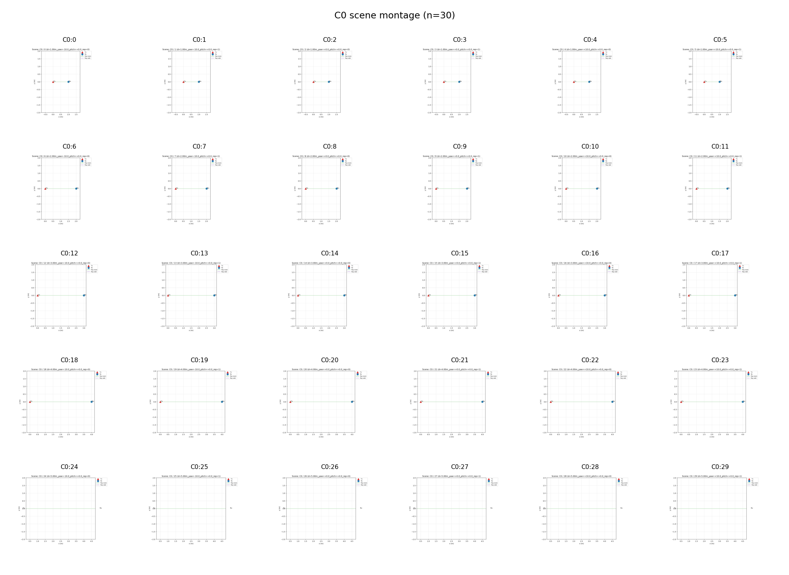

## A2

- Montage: [A2__ALL__scene_montage.png](figures/A2__ALL__scene_montage.png)
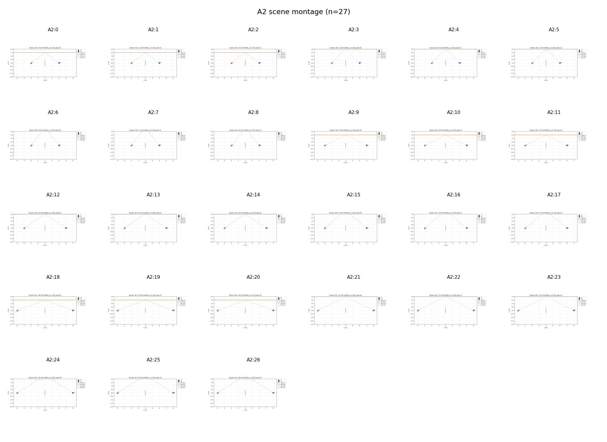

## A3

- Montage: [A3__ALL__scene_montage.png](figures/A3__ALL__scene_montage.png)
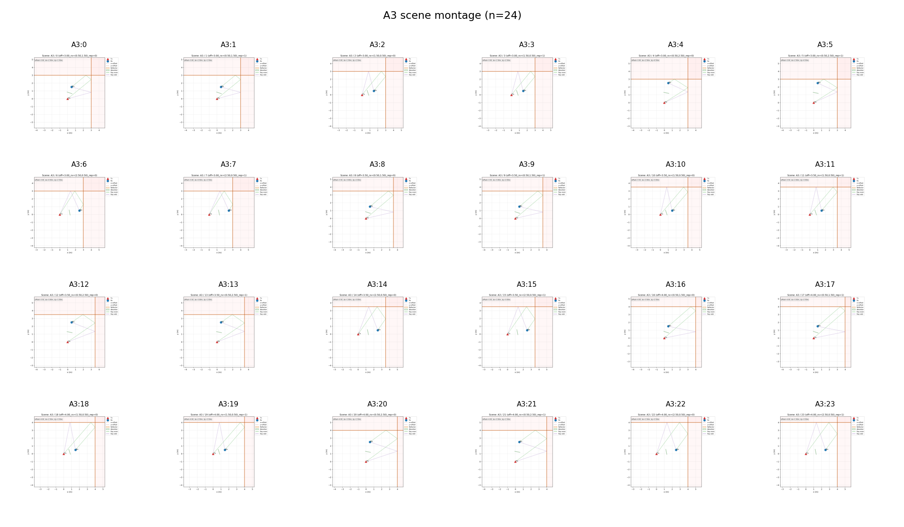

## A4

- Montage: [A4__ALL__scene_montage.png](figures/A4__ALL__scene_montage.png)
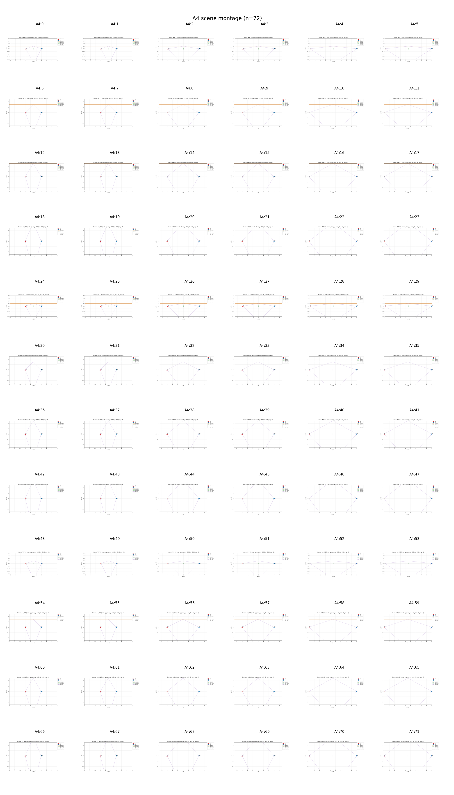

## A5

- Montage: [A5__ALL__scene_montage.png](figures/A5__ALL__scene_montage.png)
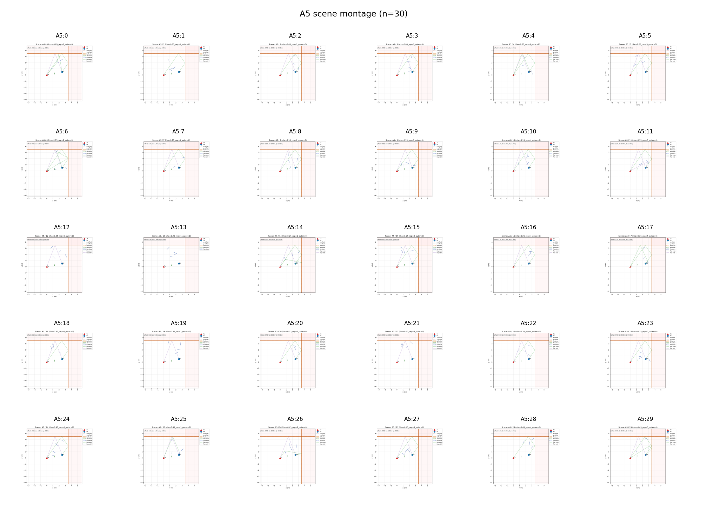

## B1

- Montage: [B1__ALL__scene_montage.png](figures/B1__ALL__scene_montage.png)
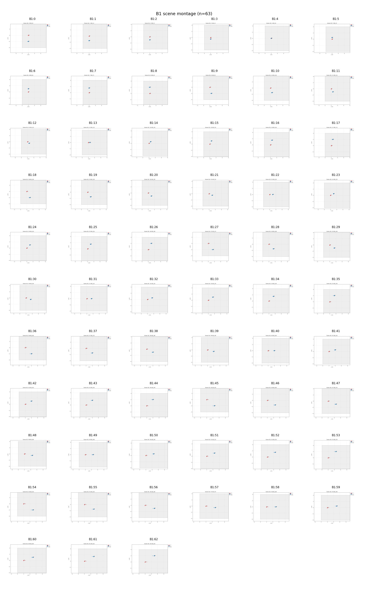

- Global layout: [B1__GLOBAL__scene.png](figures/B1__GLOBAL__scene.png)
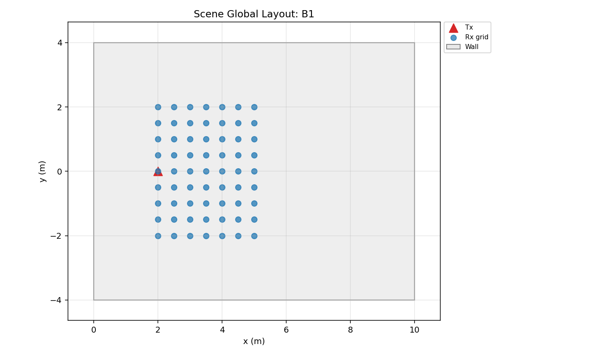

## B2

- Montage: [B2__ALL__scene_montage.png](figures/B2__ALL__scene_montage.png)
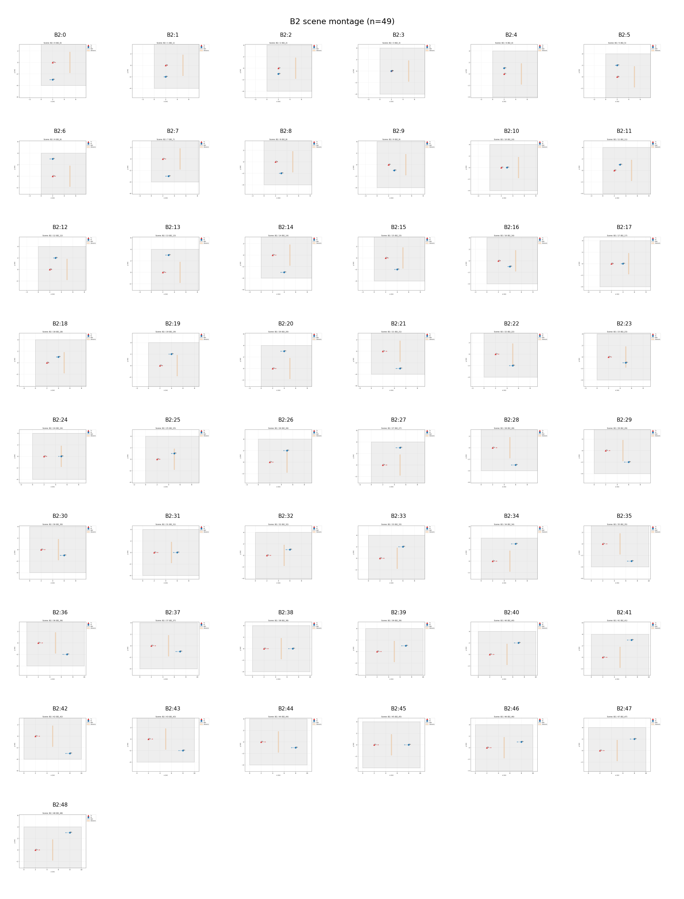

- Global layout: [B2__GLOBAL__scene.png](figures/B2__GLOBAL__scene.png)
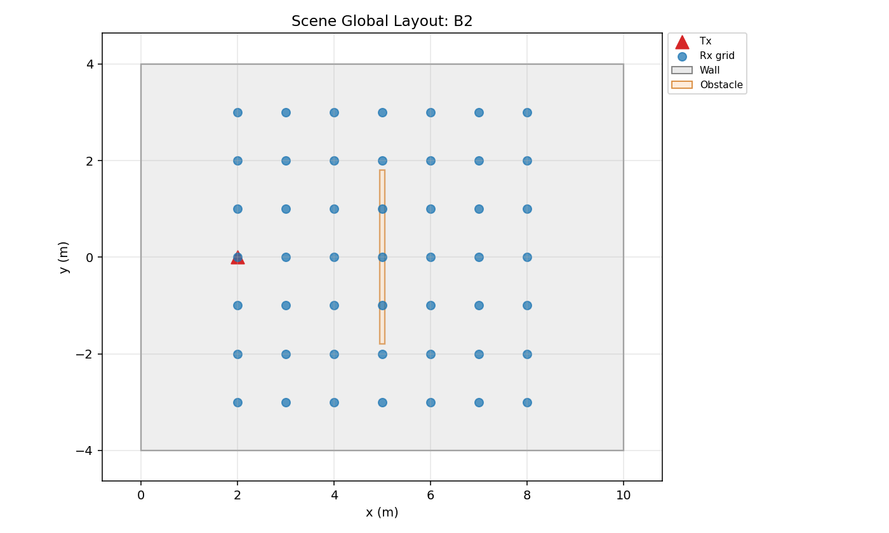

## B3

- Montage: [B3__ALL__scene_montage.png](figures/B3__ALL__scene_montage.png)
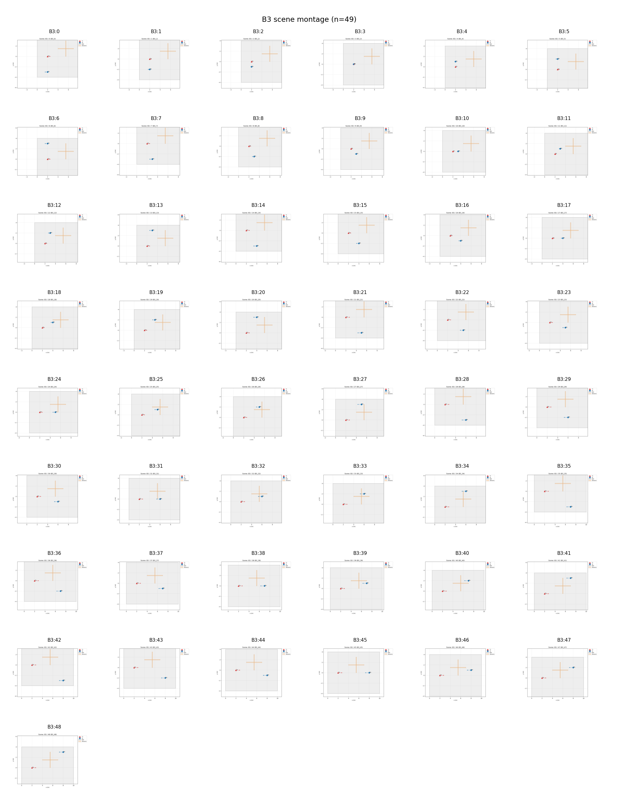

- Global layout: [B3__GLOBAL__scene.png](figures/B3__GLOBAL__scene.png)
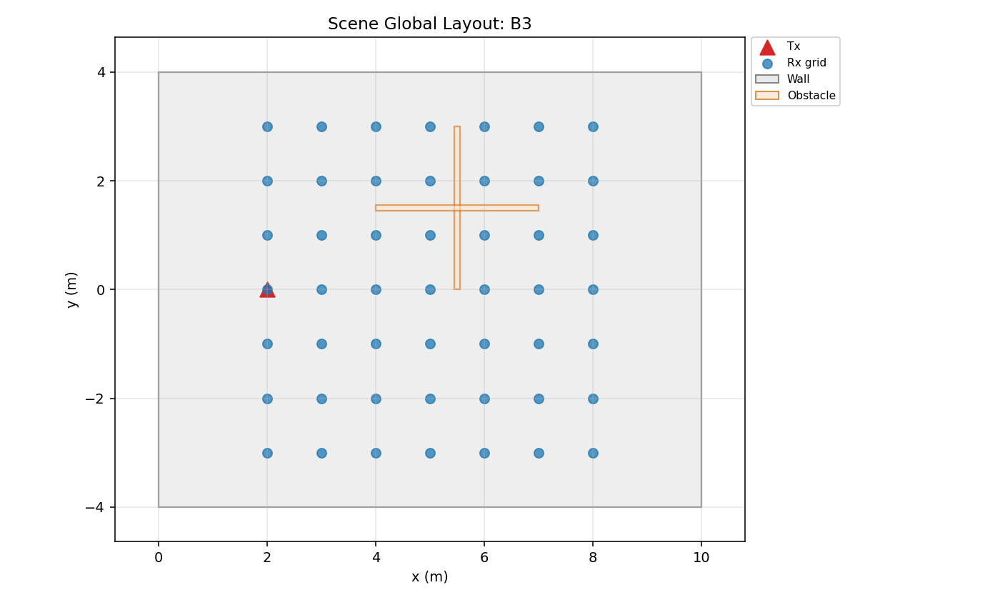

- All individual case scenes: [index.csv](index.csv), [index.md](index.md)
