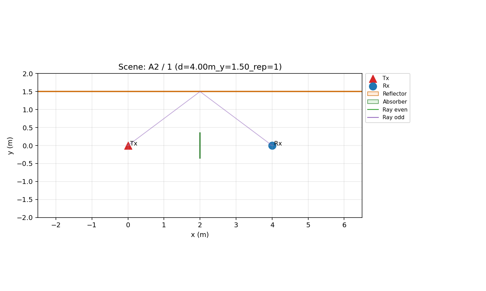
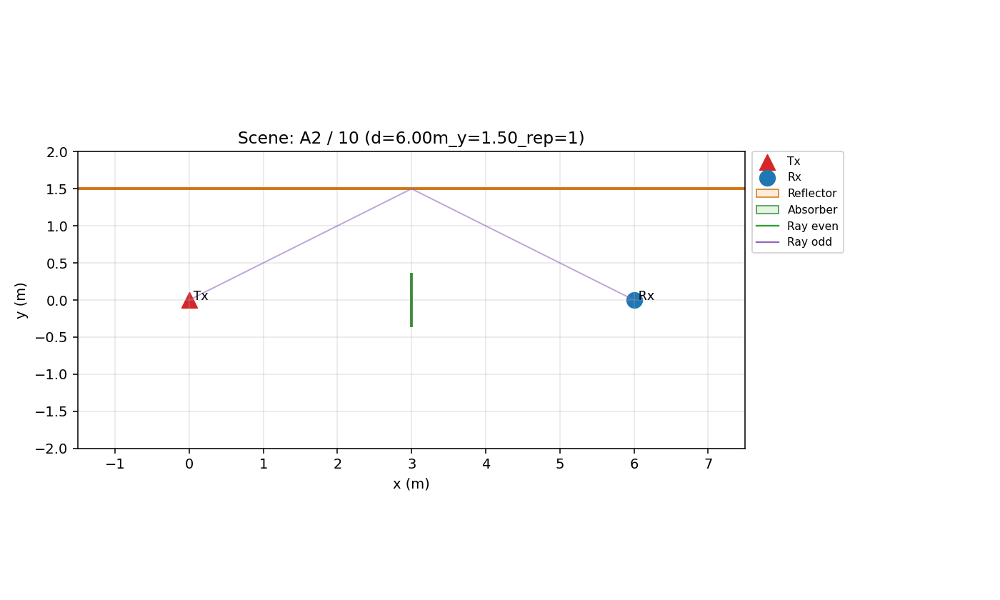
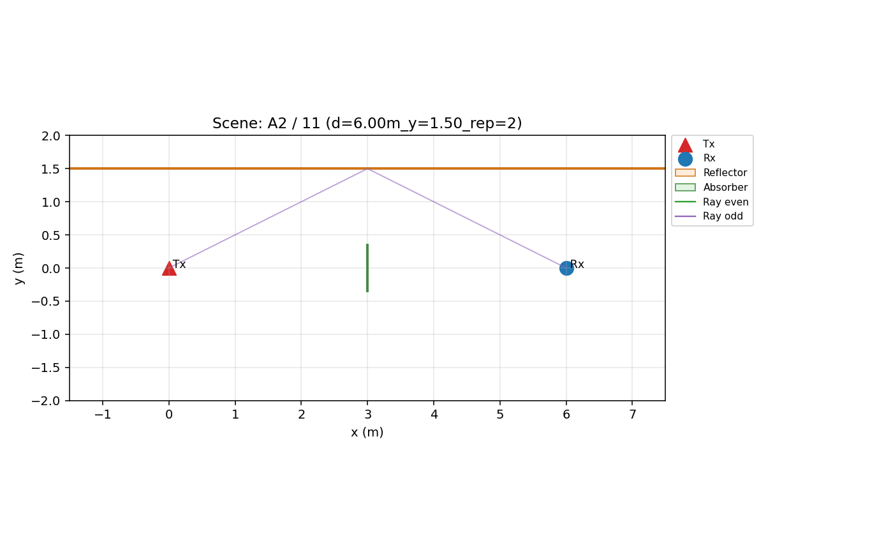
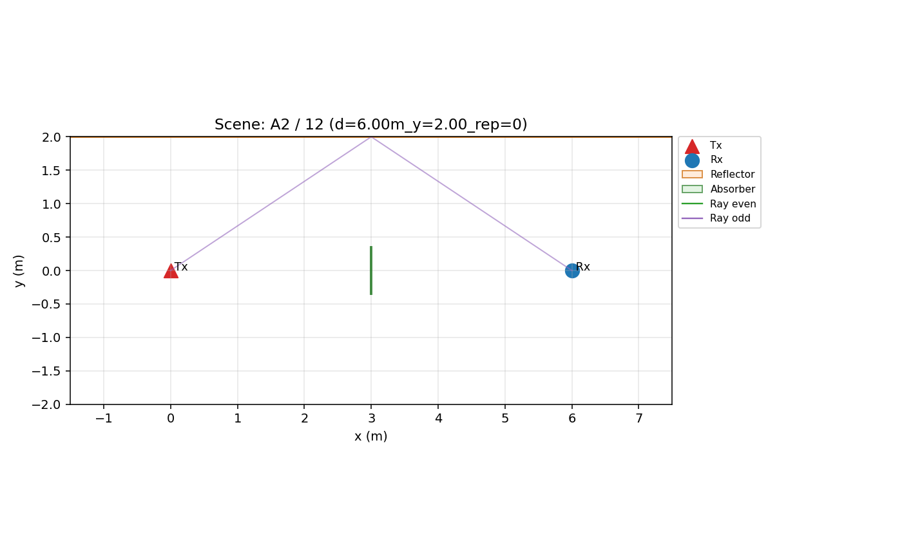
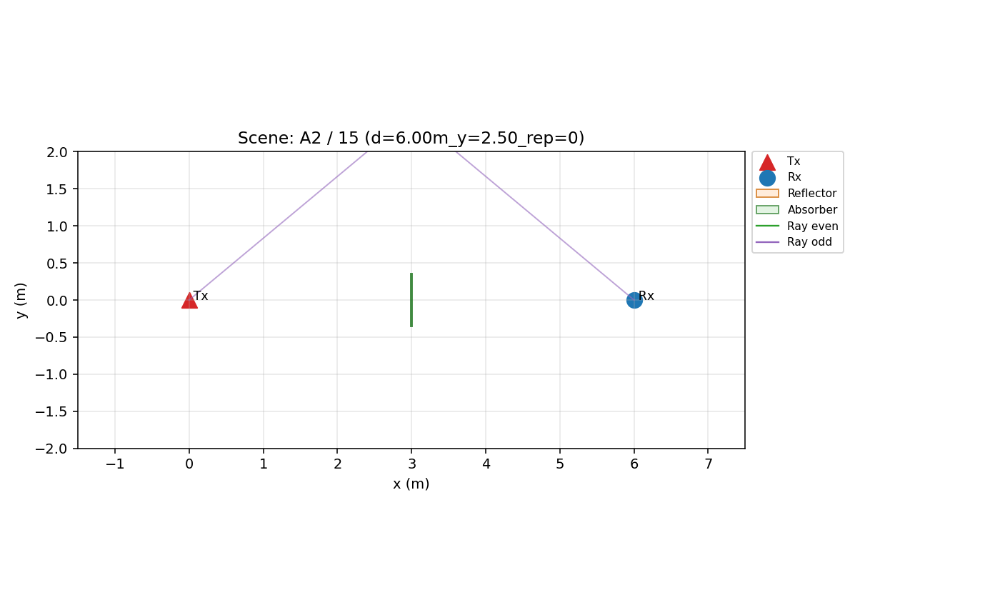

# Warning Report (tmp_c2_apply_20260301)

## Summary

- total warning cases: **10** (FAIL=0, WARN=10)
- diagnostic alerts (A-E status WARN/FAIL): **3**

## Diagnostic Alerts (from A-E)

| item | status | detail |
| --- | --- | --- |
| A3_coord_sanity | WARN | {"status": "WARN", "note": "Coordinate penetration sanity needs scenario geometry file review; not inferable from standard outputs only."} |
| B_time_resolution::W3_status | WARN | {"freq_source": "link_rows.xpd_floor_freq_hz[C0]", "BW_Hz": 4000000000.0, "df_Hz": 3910068.426197052, "dt_res_s": 2.5e-10, "tau_max_s": 2.5575000000002657e-07, "Te_s": 3.0000000000000004e-09, "Tmax_s": 3.0000000000000004e-08, "W_floor_s": 1.5000000000000002e-09, "W_target_s": 3.0000000000000004e-09, "W_floor_status": "PASS", "W_floor_C_median_db": -237.22403177507283, "A2_target_in_Wearly_rate": 1.0, "A3_target_in_Wearly_rate": 0.16666666666666666, "A2_C_target_median_db": -229.61041767359842, "A3_C_target_median_db": -228.48936099037107, "B2_min_delay_gap_median_s": 8.916297604603995e-10, "B2_status": "PASS", "B3_status": "PASS", "W3_status": "WARN", "W3_best_te_ns": 3.0, "W3_best_S_xpd_early": 0.8905187877211641, "W3_best_S_rho_early_db": 0.890518787721164, "W3_best_S_l_pol": 0.8050991864170952, "W_floor_detail": {"n_cases": 30, "W_floor_s": 1.5000000000000002e-09, "C_floor_median_db": -237.22403177507283, "C_floor_p95_db": -232.7870567827457, "rate_below_m10_db": 1.0, "rate_below_m15_db": 1.0, "status": "PASS"}, "W_target_detail": {"A2": {"scenario": "A2", "target_n": 1, "W_target_s": 3.0000000000000004e-09, "target_exists_rate": 1.0, "target_in_Wearly_rate": 1.0, "target_is_first_rate": 1.0, "C_target_median_db": -229.61041767359842, "C_target_p95_db": -227.2765510434973, "target_gap_median_s": NaN, "status": "PASS"}, "A3": {"scenario": "A3", "target_n": 2, "W_target_s": 3.0000000000000004e-09, "target_exists_rate": 1.0, "target_in_Wearly_rate": 0.16666666666666666, "target_is_first_rate": 0.0, "C_target_median_db": -228.48936099037107, "C_target_p95_db": -226.8360888049703, "target_gap_median_s": 4.670400255246654e-09, "status": "WARN"}, "A4": {"scenario": "A4", "target_n": 1, "W_target_s": 3.0000000000000004e-09, "target_exists_rate": 1.0, "target_in_Wearly_rate": 1.0, "target_is_first_rate": 1.0, "C_target_median_db": -220.5864644119584, "C_target_p95_db": -214.2857803735126, "target_gap_median_s": 1.1351827174780629e-08, "status": "PASS"}, "A5": {"scenario": "A5", "target_n": 2, "W_target_s": 3.0000000000000004e-09, "target_exists_rate": 1.0, "target_in_Wearly_rate": 0.9666666666666667, "target_is_first_rate": 0.23333333333333334, "C_target_median_db": -0.18571028639461654, "C_target_p95_db": 0.21689617192378394, "target_gap_median_s": 5.457155632733982e-10, "status": "FAIL"}}, "W3_te_sweep": {"status": "WARN", "n_links_used": 161, "scores": [{"Te_ns": 2.0, "S_xpd_early": 0.8571651548274015, "S_rho_early_db": 0.8571651548274015, "S_l_pol": 0.692530822739481}, {"Te_ns": 3.0, "S_xpd_early": 0.8905187877211641, "S_rho_early_db": 0.890518787721164, "S_l_pol": 0.8050991864170952}, {"Te_ns": 5.0, "S_xpd_early": 0.816830403759293, "S_rho_early_db": 0.8168304037592927, "S_l_pol": 0.7715728297957796}], "best_te_ns": 3.0, "best_S_xpd_early": 0.8905187877211641, "best_S_rho_early_db": 0.890518787721164, "best_S_l_pol": 0.8050991864170952}, "A2A3_sign_stability": {"A2": {"expected_sign": "negative", "min_hit_rate": 1.0, "median_hit_rate": 1.0, "per_te": [{"Te_ns": 2.0, "n": 27, "median_xpd_early_ex_db": -32.934837696767445, "expected_sign_hit_rate": 1.0}, {"Te_ns": 3.0, "n": 27, "median_xpd_early_ex_db": -32.934837696767445, "expected_sign_hit_rate": 1.0}, {"Te_ns": 5.0, "n": 27, "median_xpd_early_ex_db": -32.934837696767445, "expected_sign_hit_rate": 1.0}], "status": "PASS"}, "A3": {"expected_sign": "positive", "min_hit_rate": 0.0, "median_hit_rate": 0.0, "per_te": [{"Te_ns": 2.0, "n": 24, "median_xpd_early_ex_db": -32.934837696767445, "expected_sign_hit_rate": 0.0}, {"Te_ns": 3.0, "n": 24, "median_xpd_early_ex_db": -32.934837696767445, "expected_sign_hit_rate": 0.0}, {"Te_ns": 5.0, "n": 24, "median_xpd_early_ex_db": -26.135195019674363, "expected_sign_hit_rate": 0.0}], "status": "FAIL"}, "overall_status": "FAIL"}, "A2_target_window_sign": {"scenario": "A2", "target_n": 1, "W_target_s": 3.0000000000000004e-09, "expected_sign": "negative", "n_links": 27, "n_eval": 27, "median_xpd_target_ex_db": -32.934837696767445, "p10_xpd_target_ex_db": -32.934837696767445, "p90_xpd_target_ex_db": -32.934837696767445, "expected_sign_hit_rate": 1.0, "status": "PASS"}, "A3_target_window_sign": {"scenario": "A3", "target_n": 2, "W_target_s": 3.0000000000000004e-09, "expected_sign": "positive", "n_links": 24, "n_eval": 24, "median_xpd_target_ex_db": -16.93483769676745, "p10_xpd_target_ex_db": -25.41451287851512, "p90_xpd_target_ex_db": -16.93483769676745, "expected_sign_hit_rate": 0.0, "status": "FAIL"}, "A3_role": "mechanism", "A3_mechanism_status": "PASS", "A3_system_early_status": "FAIL", "A5_role": "stress_response", "A5_target_mode": "contamination_response"} |
| D_identifiability | WARN | {"EL_iqr_db": 7.70495832066058, "corr_d_vs_LOS": -0.5151213728974526, "strata_counts": {"LOS0_q1": 28, "LOS0_q2": 7, "LOS0_q3": 0, "LOS1_q1": 26, "LOS1_q2": 50, "LOS1_q3": 49, "LOS0_qNA": 0, "LOS1_qNA": 1}, "min_strata_n": 7, "status": "WARN", "D1": {"status": "PASS", "global": {"status": "PASS", "subset": ["A3", "A4", "B1", "B2", "B3"], "EL_iqr_db": 7.70495832066058, "el_bins_low_mid_high": {"low": 85, "mid": 87, "high": 84}, "min_bin_n": 84, "n_rows": 257}, "A2_isolation": {"status": "PASS", "n_rows": 27, "EL_std_db": 6.828340253617188e-15, "target": "small EL variation is desired for parity isolation"}, "A5_isolation": {"status": "PASS", "role": "stress_response", "n_base": 30, "n_stress": 29, "delta_median_EL_stress_minus_base_db": -2.4888276868568227, "target": "response mode: L_pol decrease is primary, EL shift can be non-zero"}}, "D2": {"status": "PASS", "material_x_angle_status": "PASS", "material_x_angle_groups_good": 3, "material_x_angle_groups_total": 3, "material_x_angle_coverage": {"glass": {"low": 2, "mid": 10, "high": 12, "NA": 0}, "wood": {"low": 2, "mid": 10, "high": 12, "NA": 0}, "gypsum": {"low": 2, "mid": 10, "high": 12, "NA": 0}}, "stress_x_angle_status": "PASS", "stress_x_angle_groups_good": 2, "stress_x_angle_groups_total": 2, "stress_x_angle_coverage": {"base": {"low": 25, "mid": 5, "high": 0, "NA": 0}, "stress": {"low": 25, "mid": 5, "high": 0, "NA": 0}}, "design_status": "PASS", "stage1": {"status": "PASS", "n_rows": 257, "design_rank": 8, "design_cols": 8, "condition_number": 85.99942796575378, "vif_threshold": 5.0, "vif": {"EL_proxy_db": 4.422813615241728, "d_m": 2.567339550535119}, "vif_warnings": {}}, "stage2": {"status": "PASS", "n_rows": 344, "design_rank": 5, "design_cols": 5, "condition_number": 8.015021370931713, "vif_threshold": 5.0, "vif": {}, "vif_warnings": {}}, "design_rank": 8, "design_cols": 8, "condition_number": 85.99942796575378, "vif_threshold": 5.0, "vif": {"stage1": {"EL_proxy_db": 4.422813615241728, "d_m": 2.567339550535119}, "stage2": {}}, "vif_warnings": {"stage1": {}, "stage2": {}}}, "D3": {"status": "WARN", "n_rows": 161, "q1_db": 1.1495989308566195, "q2_db": 4.190098339356254, "all_6_bins": ["LOS0_q1", "LOS0_q2", "LOS0_q3", "LOS1_q1", "LOS1_q2", "LOS1_q3"], "viable_bins": ["LOS0_q1", "LOS0_q2", "LOS1_q1", "LOS1_q2", "LOS1_q3"], "min_strata_all_n": 0, "min_strata_viable_n": 7, "qna_total": 1, "strata_counts": {"LOS0_q1": 28, "LOS0_q2": 7, "LOS0_q3": 0, "LOS1_q1": 26, "LOS1_q2": 50, "LOS1_q3": 49, "LOS0_qNA": 0, "LOS1_qNA": 1}, "selected_rows_n": 0, "strata_counts_selected": {}, "hole_analysis": [{"strata": "LOS0_q1", "pool_n": 28, "selected_n": "", "hole_type": "none", "status": "PASS"}, {"strata": "LOS0_q2", "pool_n": 7, "selected_n": "", "hole_type": "none", "status": "PASS"}, {"strata": "LOS0_q3", "pool_n": 0, "selected_n": "", "hole_type": "structural_hole", "status": "FAIL"}, {"strata": "LOS1_q1", "pool_n": 26, "selected_n": "", "hole_type": "none", "status": "PASS"}, {"strata": "LOS1_q2", "pool_n": 50, "selected_n": "", "hole_type": "none", "status": "PASS"}, {"strata": "LOS1_q3", "pool_n": 49, "selected_n": "", "hole_type": "none", "status": "PASS"}], "per_scenario_summary": [{"scenario_id": "B1", "status": "FAIL", "n_rows": 63, "q1_db": 3.5888713972518698, "q2_db": 5.500226147484215, "min_strata_all_n": 0, "min_strata_viable_n": 1, "qna_total": 0, "strata_counts": {"LOS0_q1": 1, "LOS0_q2": 0, "LOS0_q3": 0, "LOS1_q1": 20, "LOS1_q2": 21, "LOS1_q3": 21, "LOS0_qNA": 0, "LOS1_qNA": 0}}, {"scenario_id": "B2", "status": "WARN", "n_rows": 49, "q1_db": -0.2894841872356807, "q2_db": 2.6873310661948224, "min_strata_all_n": 2, "min_strata_viable_n": 2, "qna_total": 0, "strata_counts": {"LOS0_q1": 14, "LOS0_q2": 2, "LOS0_q3": 4, "LOS1_q1": 2, "LOS1_q2": 16, "LOS1_q3": 11, "LOS0_qNA": 0, "LOS1_qNA": 0}}, {"scenario_id": "B3", "status": "FAIL", "n_rows": 49, "q1_db": 0.3646814592558414, "q2_db": 2.5763033174518277, "min_strata_all_n": 1, "min_strata_viable_n": 1, "qna_total": 1, "strata_counts": {"LOS0_q1": 10, "LOS0_q2": 1, "LOS0_q3": 3, "LOS1_q1": 7, "LOS1_q2": 14, "LOS1_q3": 13, "LOS0_qNA": 0, "LOS1_qNA": 1}}]}} |

## Warning Cases Table

| severity | scenario_id | case_id | case_label | link_id | scene_source | XPD_early_excess_db | XPD_late_excess_db | L_pol_db | EL_proxy_db | LOSflag |
| --- | --- | --- | --- | --- | --- | --- | --- | --- | --- | --- |
| WARN | A2 | 0 | A2_0 | A2_0 | scene_debug_json | -32.93 | -24.93 | -8 | 2.72 | 0 |
| WARN | A2 | 1 | A2_1 | A2_1 | scene_debug_json | -32.93 | -24.93 | -8 | 2.72 | 0 |
| WARN | A2 | 10 | A2_10 | A2_10 | scene_debug_json | -32.93 | -24.93 | -8 | 2.72 | 0 |
| WARN | A2 | 11 | A2_11 | A2_11 | scene_debug_json | -32.93 | -24.93 | -8 | 2.72 | 0 |
| WARN | A2 | 12 | A2_12 | A2_12 | scene_debug_json | -32.93 | -24.93 | -8 | 2.72 | 0 |
| WARN | A2 | 13 | A2_13 | A2_13 | scene_debug_json | -32.93 | -24.93 | -8 | 2.72 | 0 |
| WARN | A2 | 14 | A2_14 | A2_14 | scene_debug_json | -32.93 | -24.93 | -8 | 2.72 | 0 |
| WARN | A2 | 15 | A2_15 | A2_15 | scene_debug_json | -32.93 | -24.93 | -8 | 2.72 | 0 |
| WARN | A2 | 16 | A2_16 | A2_16 | scene_debug_json | -32.93 | -24.93 | -8 | 2.72 | 0 |
| WARN | A2 | 17 | A2_17 | A2_17 | scene_debug_json | -32.93 | -24.93 | -8 | 2.72 | 0 |

## Case-by-case Review

### [WARN] A2/0 (A2_0)

- scenario 의미: LOS-blocked single-bounce(odd) control to probe early cross-leakage increase.
- case_label: A2_0
- scene_source: scene_debug_json
- reasons:
  - target tau 16.678ns >= Te 3.000ns

| XPD_early_excess_db | XPD_late_excess_db | L_pol_db | EL_proxy_db | LOSflag |
| --- | --- | --- | --- | --- |
| -32.93 | -24.93 | -8 | 2.72 | 0 |

Top rays

| rank | ray_index | n_bounce | P_lin | tau_ns | los_flag_ray | material_class |
| --- | --- | --- | --- | --- | --- | --- |
| 1 | 0 | 1 | 1.902e-07 | 16.68 | 0 | 1 |

### [WARN] A2/1 (A2_1)

- scenario 의미: LOS-blocked single-bounce(odd) control to probe early cross-leakage increase.
- case_label: A2_1
- scene_source: scene_debug_json
- reasons:
  - target tau 16.678ns >= Te 3.000ns

| XPD_early_excess_db | XPD_late_excess_db | L_pol_db | EL_proxy_db | LOSflag |
| --- | --- | --- | --- | --- |
| -32.93 | -24.93 | -8 | 2.72 | 0 |

Top rays

| rank | ray_index | n_bounce | P_lin | tau_ns | los_flag_ray | material_class |
| --- | --- | --- | --- | --- | --- | --- |
| 1 | 0 | 1 | 1.902e-07 | 16.68 | 0 | 1 |

### [WARN] A2/10 (A2_10)

- scenario 의미: LOS-blocked single-bounce(odd) control to probe early cross-leakage increase.
- case_label: A2_10
- scene_source: scene_debug_json
- reasons:
  - target tau 22.376ns >= Te 3.000ns

| XPD_early_excess_db | XPD_late_excess_db | L_pol_db | EL_proxy_db | LOSflag |
| --- | --- | --- | --- | --- |
| -32.93 | -24.93 | -8 | 2.72 | 0 |

Top rays

| rank | ray_index | n_bounce | P_lin | tau_ns | los_flag_ray | material_class |
| --- | --- | --- | --- | --- | --- | --- |
| 1 | 0 | 1 | 1.056e-07 | 22.38 | 0 | 1 |

### [WARN] A2/11 (A2_11)

- scenario 의미: LOS-blocked single-bounce(odd) control to probe early cross-leakage increase.
- case_label: A2_11
- scene_source: scene_debug_json
- reasons:
  - target tau 22.376ns >= Te 3.000ns

| XPD_early_excess_db | XPD_late_excess_db | L_pol_db | EL_proxy_db | LOSflag |
| --- | --- | --- | --- | --- |
| -32.93 | -24.93 | -8 | 2.72 | 0 |

Top rays

| rank | ray_index | n_bounce | P_lin | tau_ns | los_flag_ray | material_class |
| --- | --- | --- | --- | --- | --- | --- |
| 1 | 0 | 1 | 1.056e-07 | 22.38 | 0 | 1 |

### [WARN] A2/12 (A2_12)

- scenario 의미: LOS-blocked single-bounce(odd) control to probe early cross-leakage increase.
- case_label: A2_12
- scene_source: scene_debug_json
- reasons:
  - target tau 24.054ns >= Te 3.000ns

| XPD_early_excess_db | XPD_late_excess_db | L_pol_db | EL_proxy_db | LOSflag |
| --- | --- | --- | --- | --- |
| -32.93 | -24.93 | -8 | 2.72 | 0 |

Top rays

| rank | ray_index | n_bounce | P_lin | tau_ns | los_flag_ray | material_class |
| --- | --- | --- | --- | --- | --- | --- |
| 1 | 0 | 1 | 9.142e-08 | 24.05 | 0 | 1 |

### [WARN] A2/13 (A2_13)

- scenario 의미: LOS-blocked single-bounce(odd) control to probe early cross-leakage increase.
- case_label: A2_13
- scene_source: scene_debug_json
- reasons:
  - target tau 24.054ns >= Te 3.000ns

| XPD_early_excess_db | XPD_late_excess_db | L_pol_db | EL_proxy_db | LOSflag |
| --- | --- | --- | --- | --- |
| -32.93 | -24.93 | -8 | 2.72 | 0 |

Top rays

| rank | ray_index | n_bounce | P_lin | tau_ns | los_flag_ray | material_class |
| --- | --- | --- | --- | --- | --- | --- |
| 1 | 0 | 1 | 9.142e-08 | 24.05 | 0 | 1 |

### [WARN] A2/14 (A2_14)

- scenario 의미: LOS-blocked single-bounce(odd) control to probe early cross-leakage increase.
- case_label: A2_14
- scene_source: scene_debug_json
- reasons:
  - target tau 24.054ns >= Te 3.000ns

| XPD_early_excess_db | XPD_late_excess_db | L_pol_db | EL_proxy_db | LOSflag |
| --- | --- | --- | --- | --- |
| -32.93 | -24.93 | -8 | 2.72 | 0 |

Top rays

| rank | ray_index | n_bounce | P_lin | tau_ns | los_flag_ray | material_class |
| --- | --- | --- | --- | --- | --- | --- |
| 1 | 0 | 1 | 9.142e-08 | 24.05 | 0 | 1 |

### [WARN] A2/15 (A2_15)

- scenario 의미: LOS-blocked single-bounce(odd) control to probe early cross-leakage increase.
- case_label: A2_15
- scene_source: scene_debug_json
- reasons:
  - target tau 26.052ns >= Te 3.000ns

| XPD_early_excess_db | XPD_late_excess_db | L_pol_db | EL_proxy_db | LOSflag |
| --- | --- | --- | --- | --- |
| -32.93 | -24.93 | -8 | 2.72 | 0 |

Top rays

| rank | ray_index | n_bounce | P_lin | tau_ns | los_flag_ray | material_class |
| --- | --- | --- | --- | --- | --- | --- |
| 1 | 0 | 1 | 7.793e-08 | 26.05 | 0 | 1 |

### [WARN] A2/16 (A2_16)

- scenario 의미: LOS-blocked single-bounce(odd) control to probe early cross-leakage increase.
- case_label: A2_16
- scene_source: scene_debug_json
- reasons:
  - target tau 26.052ns >= Te 3.000ns

| XPD_early_excess_db | XPD_late_excess_db | L_pol_db | EL_proxy_db | LOSflag |
| --- | --- | --- | --- | --- |
| -32.93 | -24.93 | -8 | 2.72 | 0 |

Top rays

| rank | ray_index | n_bounce | P_lin | tau_ns | los_flag_ray | material_class |
| --- | --- | --- | --- | --- | --- | --- |
| 1 | 0 | 1 | 7.793e-08 | 26.05 | 0 | 1 |

### [WARN] A2/17 (A2_17)

- scenario 의미: LOS-blocked single-bounce(odd) control to probe early cross-leakage increase.
- case_label: A2_17
- scene_source: scene_debug_json
- reasons:
  - target tau 26.052ns >= Te 3.000ns

| XPD_early_excess_db | XPD_late_excess_db | L_pol_db | EL_proxy_db | LOSflag |
| --- | --- | --- | --- | --- |
| -32.93 | -24.93 | -8 | 2.72 | 0 |

Top rays

| rank | ray_index | n_bounce | P_lin | tau_ns | los_flag_ray | material_class |
| --- | --- | --- | --- | --- | --- | --- |
| 1 | 0 | 1 | 7.793e-08 | 26.05 | 0 | 1 |

