# Warning Report (report_20260227_current)

## Summary

- total warning cases: **80** (FAIL=12, WARN=68)
- diagnostic alerts (A-E status WARN/FAIL): **3**

## Diagnostic Alerts (from A-E)

| item | status | detail |
| --- | --- | --- |
| A3_coord_sanity | WARN | {"status": "WARN", "note": "Coordinate penetration sanity needs scenario geometry file review; not inferable from standard outputs only."} |
| B_time_resolution::B2_status | WARN | {"dt_res_s": 1e-09, "tau_max_s": 1e-06, "Te_s": 1e-08, "Tmax_s": 2.0000000000000002e-07, "B1_target_in_early_rate_A2": 0.0, "B1_target_in_early_rate_A3": 0.0, "B2_min_delay_gap_median_s": 0.0, "B2_status": "WARN", "B3_status": "PASS"} |
| D_identifiability | WARN | {"EL_iqr_db": 2.2431072202267295, "corr_d_vs_LOS": -0.5493884215888136, "strata_counts": {"LOS0_q2": 106, "LOS0_q1": 94, "LOS0_q3": 96, "LOS1_q1": 59, "LOS1_q3": 37, "LOS1_q2": 66}, "min_strata_n": 37, "status": "WARN"} |

## Warning Cases Table

| severity | scenario_id | case_id | case_label | link_id | scene_source | XPD_early_excess_db | XPD_late_excess_db | L_pol_db | EL_proxy_db | LOSflag |
| --- | --- | --- | --- | --- | --- | --- | --- | --- | --- | --- |
| FAIL | A3 | 12 | A3_12 | A3_12 | fallback_layout | -24.93 | -24.93 | 0 | nan | 0 |
| FAIL | A3 | 13 | A3_13 | A3_13 | fallback_layout | -24.93 | -24.93 | 0 | nan | 0 |
| FAIL | A3 | 14 | A3_14 | A3_14 | fallback_layout | -24.93 | -24.93 | 0 | nan | 0 |
| FAIL | A3 | 15 | A3_15 | A3_15 | fallback_layout | -24.93 | -24.93 | 0 | nan | 0 |
| FAIL | A3 | 16 | A3_16 | A3_16 | fallback_layout | -32.93 | -24.93 | -8 | 2.72 | 0 |
| FAIL | A3 | 17 | A3_17 | A3_17 | fallback_layout | -32.93 | -24.93 | -8 | 2.72 | 0 |
| FAIL | A3 | 2 | A3_2 | A3_2 | fallback_layout | -24.93 | -24.93 | 0 | nan | 0 |
| FAIL | A3 | 3 | A3_3 | A3_3 | fallback_layout | -24.93 | -24.93 | 0 | nan | 0 |
| FAIL | A3 | 4 | A3_4 | A3_4 | fallback_layout | -24.93 | -24.93 | 0 | nan | 0 |
| FAIL | A3 | 5 | A3_5 | A3_5 | fallback_layout | -24.93 | -24.93 | 0 | nan | 0 |
| FAIL | A3 | 6 | A3_6 | A3_6 | fallback_layout | -24.93 | -24.93 | 0 | nan | 0 |
| FAIL | A3 | 7 | A3_7 | A3_7 | fallback_layout | -24.93 | -24.93 | 0 | nan | 0 |
| WARN | A2 | 0 | A2_0 | A2_0 | fallback_layout | -31.27 | -23.27 | -8 | 2.72 | 0 |
| WARN | A2 | 1 | A2_1 | A2_1 | fallback_layout | -31.27 | -23.27 | -8 | 2.72 | 0 |
| WARN | A2 | 10 | A2_10 | A2_10 | fallback_layout | -31.27 | -23.27 | -8 | 2.72 | 0 |
| WARN | A2 | 11 | A2_11 | A2_11 | fallback_layout | -31.27 | -23.27 | -8 | 2.72 | 0 |
| WARN | A2 | 12 | A2_12 | A2_12 | fallback_layout | -31.27 | -23.27 | -8 | 2.72 | 0 |
| WARN | A2 | 13 | A2_13 | A2_13 | fallback_layout | -31.27 | -23.27 | -8 | 2.72 | 0 |
| WARN | A2 | 14 | A2_14 | A2_14 | fallback_layout | -31.27 | -23.27 | -8 | 2.72 | 0 |
| WARN | A2 | 15 | A2_15 | A2_15 | fallback_layout | -31.27 | -23.27 | -8 | 2.72 | 0 |
| WARN | A2 | 16 | A2_16 | A2_16 | fallback_layout | -31.27 | -23.27 | -8 | 2.72 | 0 |
| WARN | A2 | 17 | A2_17 | A2_17 | fallback_layout | -31.27 | -23.27 | -8 | 2.72 | 0 |
| WARN | A2 | 18 | A2_18 | A2_18 | fallback_layout | -31.27 | -23.27 | -8 | 2.72 | 0 |
| WARN | A2 | 19 | A2_19 | A2_19 | fallback_layout | -31.27 | -23.27 | -8 | 2.72 | 0 |
| WARN | A2 | 2 | A2_2 | A2_2 | fallback_layout | -31.27 | -23.27 | -8 | 2.72 | 0 |
| WARN | A2 | 20 | A2_20 | A2_20 | fallback_layout | -31.27 | -23.27 | -8 | 2.72 | 0 |
| WARN | A2 | 21 | A2_21 | A2_21 | fallback_layout | -31.27 | -23.27 | -8 | 2.72 | 0 |
| WARN | A2 | 22 | A2_22 | A2_22 | fallback_layout | -31.27 | -23.27 | -8 | 2.72 | 0 |
| WARN | A2 | 23 | A2_23 | A2_23 | fallback_layout | -31.27 | -23.27 | -8 | 2.72 | 0 |
| WARN | A2 | 24 | A2_24 | A2_24 | fallback_layout | -31.27 | -23.27 | -8 | 2.72 | 0 |
| WARN | A2 | 25 | A2_25 | A2_25 | fallback_layout | -31.27 | -23.27 | -8 | 2.72 | 0 |
| WARN | A2 | 26 | A2_26 | A2_26 | fallback_layout | -31.27 | -23.27 | -8 | 2.72 | 0 |
| WARN | A2 | 3 | A2_3 | A2_3 | fallback_layout | -31.27 | -23.27 | -8 | 2.72 | 0 |
| WARN | A2 | 4 | A2_4 | A2_4 | fallback_layout | -31.27 | -23.27 | -8 | 2.72 | 0 |
| WARN | A2 | 5 | A2_5 | A2_5 | fallback_layout | -31.27 | -23.27 | -8 | 2.72 | 0 |
| WARN | A2 | 6 | A2_6 | A2_6 | fallback_layout | -31.27 | -23.27 | -8 | 2.72 | 0 |
| WARN | A2 | 7 | A2_7 | A2_7 | fallback_layout | -31.27 | -23.27 | -8 | 2.72 | 0 |
| WARN | A2 | 8 | A2_8 | A2_8 | fallback_layout | -31.27 | -23.27 | -8 | 2.72 | 0 |
| WARN | A2 | 9 | A2_9 | A2_9 | fallback_layout | -31.27 | -23.27 | -8 | 2.72 | 0 |
| WARN | A3 | 0 | A3_0 | A3_0 | fallback_layout | -16.93 | -24.93 | 8 | 2.72 | 0 |
| WARN | A3 | 1 | A3_1 | A3_1 | fallback_layout | -16.93 | -24.93 | 8 | 2.72 | 0 |
| WARN | A3 | 10 | A3_10 | A3_10 | fallback_layout | -16.93 | -24.93 | 8 | 2.72 | 0 |
| WARN | A3 | 11 | A3_11 | A3_11 | fallback_layout | -16.93 | -24.93 | 8 | 2.72 | 0 |
| WARN | A3 | 18 | A3_18 | A3_18 | fallback_layout | -27.9 | -24.93 | -2.965 | -1.679 | 0 |
| WARN | A3 | 19 | A3_19 | A3_19 | fallback_layout | -27.9 | -24.93 | -2.965 | -1.679 | 0 |
| WARN | A3 | 20 | A3_20 | A3_20 | fallback_layout | -16.93 | -24.93 | 8 | 2.72 | 0 |
| WARN | A3 | 21 | A3_21 | A3_21 | fallback_layout | -16.93 | -24.93 | 8 | 2.72 | 0 |
| WARN | A3 | 22 | A3_22 | A3_22 | fallback_layout | -16.93 | -24.93 | 8 | 2.72 | 0 |
| WARN | A3 | 23 | A3_23 | A3_23 | fallback_layout | -16.93 | -24.93 | 8 | 2.72 | 0 |
| WARN | A3 | 8 | A3_8 | A3_8 | fallback_layout | -28.03 | -24.93 | -3.094 | -1.626 | 0 |
| WARN | A3 | 9 | A3_9 | A3_9 | fallback_layout | -28.03 | -24.93 | -3.094 | -1.626 | 0 |
| WARN | A4 | 0 | A4_0 | A4_0 | fallback_layout | -34.86 | -24.93 | -9.922 | 8.343 | 0 |
| WARN | A4 | 1 | A4_1 | A4_1 | fallback_layout | -34.81 | -24.93 | -9.87 | 8.343 | 0 |
| WARN | A4 | 10 | A4_10 | A4_10 | fallback_layout | -34.71 | -24.93 | -9.772 | 8.343 | 0 |
| WARN | A4 | 11 | A4_11 | A4_11 | fallback_layout | -34.84 | -24.93 | -9.905 | 8.343 | 0 |
| WARN | A4 | 12 | A4_12 | A4_12 | fallback_layout | -33.1 | -24.93 | -8.165 | 9.96 | 0 |
| WARN | A4 | 13 | A4_13 | A4_13 | fallback_layout | -33.52 | -24.93 | -8.586 | 9.96 | 0 |
| WARN | A4 | 14 | A4_14 | A4_14 | fallback_layout | -33.9 | -24.93 | -8.962 | 9.824 | 0 |
| WARN | A4 | 15 | A4_15 | A4_15 | fallback_layout | -34 | -24.93 | -9.065 | 9.824 | 0 |
| WARN | A4 | 16 | A4_16 | A4_16 | fallback_layout | -34.37 | -24.93 | -9.437 | 9.413 | 0 |
| WARN | A4 | 17 | A4_17 | A4_17 | fallback_layout | -34.42 | -24.93 | -9.483 | 9.413 | 0 |
| WARN | A4 | 18 | A4_18 | A4_18 | fallback_layout | -33.41 | -24.93 | -8.48 | 9.95 | 0 |
| WARN | A4 | 19 | A4_19 | A4_19 | fallback_layout | -33.54 | -24.93 | -8.606 | 9.95 | 0 |
| WARN | A4 | 2 | A4_2 | A4_2 | fallback_layout | -35.29 | -24.93 | -10.35 | 6.423 | 0 |
| WARN | A4 | 20 | A4_20 | A4_20 | fallback_layout | -33.83 | -24.93 | -8.894 | 9.94 | 0 |
| WARN | A4 | 21 | A4_21 | A4_21 | fallback_layout | -34.13 | -24.93 | -9.193 | 9.94 | 0 |
| WARN | A4 | 22 | A4_22 | A4_22 | fallback_layout | -34.07 | -24.93 | -9.137 | 9.779 | 0 |
| WARN | A4 | 23 | A4_23 | A4_23 | fallback_layout | -34.28 | -24.93 | -9.341 | 9.779 | 0 |
| WARN | A4 | 24 | A4_24 | A4_24 | fallback_layout | -26.96 | -24.93 | -2.023 | 10.16 | 0 |
| WARN | A4 | 25 | A4_25 | A4_25 | fallback_layout | -26.8 | -24.93 | -1.861 | 10.16 | 0 |
| WARN | A4 | 26 | A4_26 | A4_26 | fallback_layout | -27 | -24.93 | -2.064 | 6.769 | 0 |
| WARN | A4 | 27 | A4_27 | A4_27 | fallback_layout | -26.96 | -24.93 | -2.029 | 6.769 | 0 |
| WARN | A4 | 28 | A4_28 | A4_28 | fallback_layout | -27.19 | -24.93 | -2.254 | 5.485 | 0 |
| WARN | A4 | 29 | A4_29 | A4_29 | fallback_layout | -27.32 | -24.93 | -2.389 | 5.485 | 0 |
| WARN | A4 | 3 | A4_3 | A4_3 | fallback_layout | -35.18 | -24.93 | -10.24 | 6.423 | 0 |
| WARN | A4 | 30 | A4_30 | A4_30 | fallback_layout | -25.6 | -24.93 | -0.6629 | 16.17 | 0 |
| WARN | A4 | 31 | A4_31 | A4_31 | fallback_layout | -25.76 | -24.93 | -0.823 | 16.17 | 0 |
| WARN | A4 | 32 | A4_32 | A4_32 | fallback_layout | -26.42 | -24.93 | -1.489 | 12.75 | 0 |
| WARN | A4 | 33 | A4_33 | A4_33 | fallback_layout | -26.56 | -24.93 | -1.629 | 12.75 | 0 |
| WARN | A4 | 34 | A4_34 | A4_34 | fallback_layout | -26.82 | -24.93 | -1.885 | 10.16 | 0 |

## Case-by-case Review

### [FAIL] A3/12 (A3_12)

- case_label: A3_12
- scene_source: fallback_layout
- reasons:
  - scene_debug missing -> fallback spatial layout
  - target bounce n=2 missing in top-0 rays
  - missing/NaN in key metrics

| XPD_early_excess_db | XPD_late_excess_db | L_pol_db | EL_proxy_db | LOSflag |
| --- | --- | --- | --- | --- |
| -24.93 | -24.93 | 0 | nan | 0 |

### [FAIL] A3/13 (A3_13)

- case_label: A3_13
- scene_source: fallback_layout
- reasons:
  - scene_debug missing -> fallback spatial layout
  - target bounce n=2 missing in top-0 rays
  - missing/NaN in key metrics

| XPD_early_excess_db | XPD_late_excess_db | L_pol_db | EL_proxy_db | LOSflag |
| --- | --- | --- | --- | --- |
| -24.93 | -24.93 | 0 | nan | 0 |

### [FAIL] A3/14 (A3_14)

- case_label: A3_14
- scene_source: fallback_layout
- reasons:
  - scene_debug missing -> fallback spatial layout
  - target bounce n=2 missing in top-0 rays
  - missing/NaN in key metrics

| XPD_early_excess_db | XPD_late_excess_db | L_pol_db | EL_proxy_db | LOSflag |
| --- | --- | --- | --- | --- |
| -24.93 | -24.93 | 0 | nan | 0 |

### [FAIL] A3/15 (A3_15)

- case_label: A3_15
- scene_source: fallback_layout
- reasons:
  - scene_debug missing -> fallback spatial layout
  - target bounce n=2 missing in top-0 rays
  - missing/NaN in key metrics

| XPD_early_excess_db | XPD_late_excess_db | L_pol_db | EL_proxy_db | LOSflag |
| --- | --- | --- | --- | --- |
| -24.93 | -24.93 | 0 | nan | 0 |

### [FAIL] A3/16 (A3_16)

- case_label: A3_16
- scene_source: fallback_layout
- reasons:
  - scene_debug missing -> fallback spatial layout
  - target bounce n=2 missing in top-1 rays

| XPD_early_excess_db | XPD_late_excess_db | L_pol_db | EL_proxy_db | LOSflag |
| --- | --- | --- | --- | --- |
| -32.93 | -24.93 | -8 | 2.72 | 0 |

Top rays

| rank | ray_index | n_bounce | P_lin | tau_ns | los_flag_ray | material_class |
| --- | --- | --- | --- | --- | --- | --- |
| 1 | 0 | 1 | 1.159e-07 | 21.36 | 0 | 2 |

### [FAIL] A3/17 (A3_17)

- case_label: A3_17
- scene_source: fallback_layout
- reasons:
  - scene_debug missing -> fallback spatial layout
  - target bounce n=2 missing in top-1 rays

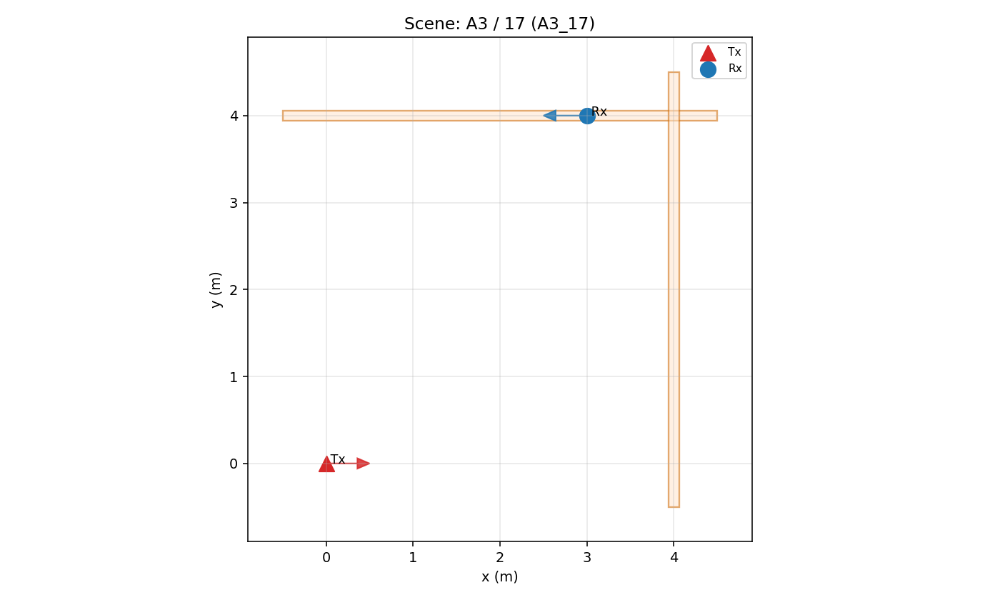

| XPD_early_excess_db | XPD_late_excess_db | L_pol_db | EL_proxy_db | LOSflag |
| --- | --- | --- | --- | --- |
| -32.93 | -24.93 | -8 | 2.72 | 0 |

Top rays

| rank | ray_index | n_bounce | P_lin | tau_ns | los_flag_ray | material_class |
| --- | --- | --- | --- | --- | --- | --- |
| 1 | 0 | 1 | 1.159e-07 | 21.36 | 0 | 2 |

### [FAIL] A3/2 (A3_2)

- case_label: A3_2
- scene_source: fallback_layout
- reasons:
  - scene_debug missing -> fallback spatial layout
  - target bounce n=2 missing in top-0 rays
  - missing/NaN in key metrics

| XPD_early_excess_db | XPD_late_excess_db | L_pol_db | EL_proxy_db | LOSflag |
| --- | --- | --- | --- | --- |
| -24.93 | -24.93 | 0 | nan | 0 |

### [FAIL] A3/3 (A3_3)

- case_label: A3_3
- scene_source: fallback_layout
- reasons:
  - scene_debug missing -> fallback spatial layout
  - target bounce n=2 missing in top-0 rays
  - missing/NaN in key metrics

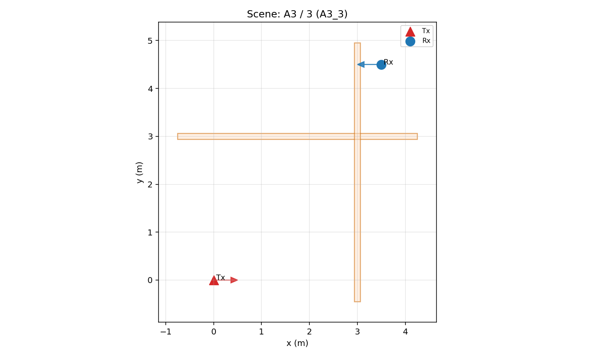

| XPD_early_excess_db | XPD_late_excess_db | L_pol_db | EL_proxy_db | LOSflag |
| --- | --- | --- | --- | --- |
| -24.93 | -24.93 | 0 | nan | 0 |

### [FAIL] A3/4 (A3_4)

- case_label: A3_4
- scene_source: fallback_layout
- reasons:
  - scene_debug missing -> fallback spatial layout
  - target bounce n=2 missing in top-0 rays
  - missing/NaN in key metrics

| XPD_early_excess_db | XPD_late_excess_db | L_pol_db | EL_proxy_db | LOSflag |
| --- | --- | --- | --- | --- |
| -24.93 | -24.93 | 0 | nan | 0 |

### [FAIL] A3/5 (A3_5)

- case_label: A3_5
- scene_source: fallback_layout
- reasons:
  - scene_debug missing -> fallback spatial layout
  - target bounce n=2 missing in top-0 rays
  - missing/NaN in key metrics

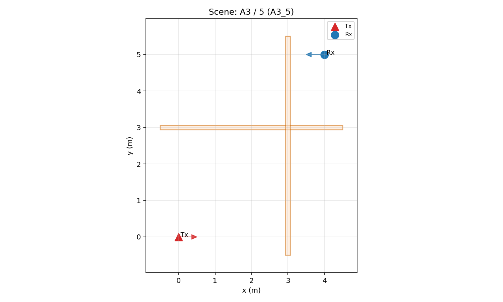

| XPD_early_excess_db | XPD_late_excess_db | L_pol_db | EL_proxy_db | LOSflag |
| --- | --- | --- | --- | --- |
| -24.93 | -24.93 | 0 | nan | 0 |

### [FAIL] A3/6 (A3_6)

- case_label: A3_6
- scene_source: fallback_layout
- reasons:
  - scene_debug missing -> fallback spatial layout
  - target bounce n=2 missing in top-0 rays
  - missing/NaN in key metrics

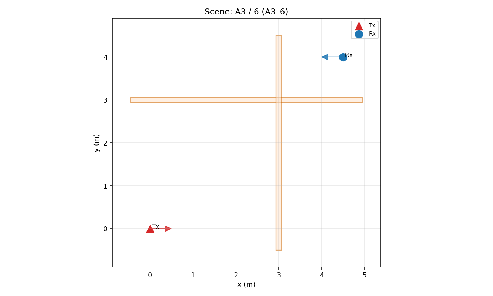

| XPD_early_excess_db | XPD_late_excess_db | L_pol_db | EL_proxy_db | LOSflag |
| --- | --- | --- | --- | --- |
| -24.93 | -24.93 | 0 | nan | 0 |

### [FAIL] A3/7 (A3_7)

- case_label: A3_7
- scene_source: fallback_layout
- reasons:
  - scene_debug missing -> fallback spatial layout
  - target bounce n=2 missing in top-0 rays
  - missing/NaN in key metrics

| XPD_early_excess_db | XPD_late_excess_db | L_pol_db | EL_proxy_db | LOSflag |
| --- | --- | --- | --- | --- |
| -24.93 | -24.93 | 0 | nan | 0 |

### [WARN] A2/0 (A2_0)

- case_label: A2_0
- scene_source: fallback_layout
- reasons:
  - scene_debug missing -> fallback spatial layout
  - target tau 16.678ns >= Te 10.000ns

| XPD_early_excess_db | XPD_late_excess_db | L_pol_db | EL_proxy_db | LOSflag |
| --- | --- | --- | --- | --- |
| -31.27 | -23.27 | -8 | 2.72 | 0 |

Top rays

| rank | ray_index | n_bounce | P_lin | tau_ns | los_flag_ray | material_class |
| --- | --- | --- | --- | --- | --- | --- |
| 1 | 0 | 1 | 1.902e-07 | 16.68 | 0 | 1 |

### [WARN] A2/1 (A2_1)

- case_label: A2_1
- scene_source: fallback_layout
- reasons:
  - scene_debug missing -> fallback spatial layout
  - target tau 16.678ns >= Te 10.000ns

| XPD_early_excess_db | XPD_late_excess_db | L_pol_db | EL_proxy_db | LOSflag |
| --- | --- | --- | --- | --- |
| -31.27 | -23.27 | -8 | 2.72 | 0 |

Top rays

| rank | ray_index | n_bounce | P_lin | tau_ns | los_flag_ray | material_class |
| --- | --- | --- | --- | --- | --- | --- |
| 1 | 0 | 1 | 1.902e-07 | 16.68 | 0 | 1 |

### [WARN] A2/10 (A2_10)

- case_label: A2_10
- scene_source: fallback_layout
- reasons:
  - scene_debug missing -> fallback spatial layout
  - target tau 22.376ns >= Te 10.000ns

| XPD_early_excess_db | XPD_late_excess_db | L_pol_db | EL_proxy_db | LOSflag |
| --- | --- | --- | --- | --- |
| -31.27 | -23.27 | -8 | 2.72 | 0 |

Top rays

| rank | ray_index | n_bounce | P_lin | tau_ns | los_flag_ray | material_class |
| --- | --- | --- | --- | --- | --- | --- |
| 1 | 0 | 1 | 1.056e-07 | 22.38 | 0 | 1 |

### [WARN] A2/11 (A2_11)

- case_label: A2_11
- scene_source: fallback_layout
- reasons:
  - scene_debug missing -> fallback spatial layout
  - target tau 22.376ns >= Te 10.000ns

| XPD_early_excess_db | XPD_late_excess_db | L_pol_db | EL_proxy_db | LOSflag |
| --- | --- | --- | --- | --- |
| -31.27 | -23.27 | -8 | 2.72 | 0 |

Top rays

| rank | ray_index | n_bounce | P_lin | tau_ns | los_flag_ray | material_class |
| --- | --- | --- | --- | --- | --- | --- |
| 1 | 0 | 1 | 1.056e-07 | 22.38 | 0 | 1 |

### [WARN] A2/12 (A2_12)

- case_label: A2_12
- scene_source: fallback_layout
- reasons:
  - scene_debug missing -> fallback spatial layout
  - target tau 24.054ns >= Te 10.000ns

| XPD_early_excess_db | XPD_late_excess_db | L_pol_db | EL_proxy_db | LOSflag |
| --- | --- | --- | --- | --- |
| -31.27 | -23.27 | -8 | 2.72 | 0 |

Top rays

| rank | ray_index | n_bounce | P_lin | tau_ns | los_flag_ray | material_class |
| --- | --- | --- | --- | --- | --- | --- |
| 1 | 0 | 1 | 9.142e-08 | 24.05 | 0 | 1 |

### [WARN] A2/13 (A2_13)

- case_label: A2_13
- scene_source: fallback_layout
- reasons:
  - scene_debug missing -> fallback spatial layout
  - target tau 24.054ns >= Te 10.000ns

| XPD_early_excess_db | XPD_late_excess_db | L_pol_db | EL_proxy_db | LOSflag |
| --- | --- | --- | --- | --- |
| -31.27 | -23.27 | -8 | 2.72 | 0 |

Top rays

| rank | ray_index | n_bounce | P_lin | tau_ns | los_flag_ray | material_class |
| --- | --- | --- | --- | --- | --- | --- |
| 1 | 0 | 1 | 9.142e-08 | 24.05 | 0 | 1 |

### [WARN] A2/14 (A2_14)

- case_label: A2_14
- scene_source: fallback_layout
- reasons:
  - scene_debug missing -> fallback spatial layout
  - target tau 24.054ns >= Te 10.000ns

| XPD_early_excess_db | XPD_late_excess_db | L_pol_db | EL_proxy_db | LOSflag |
| --- | --- | --- | --- | --- |
| -31.27 | -23.27 | -8 | 2.72 | 0 |

Top rays

| rank | ray_index | n_bounce | P_lin | tau_ns | los_flag_ray | material_class |
| --- | --- | --- | --- | --- | --- | --- |
| 1 | 0 | 1 | 9.142e-08 | 24.05 | 0 | 1 |

### [WARN] A2/15 (A2_15)

- case_label: A2_15
- scene_source: fallback_layout
- reasons:
  - scene_debug missing -> fallback spatial layout
  - target tau 26.052ns >= Te 10.000ns

| XPD_early_excess_db | XPD_late_excess_db | L_pol_db | EL_proxy_db | LOSflag |
| --- | --- | --- | --- | --- |
| -31.27 | -23.27 | -8 | 2.72 | 0 |

Top rays

| rank | ray_index | n_bounce | P_lin | tau_ns | los_flag_ray | material_class |
| --- | --- | --- | --- | --- | --- | --- |
| 1 | 0 | 1 | 7.793e-08 | 26.05 | 0 | 1 |

### [WARN] A2/16 (A2_16)

- case_label: A2_16
- scene_source: fallback_layout
- reasons:
  - scene_debug missing -> fallback spatial layout
  - target tau 26.052ns >= Te 10.000ns

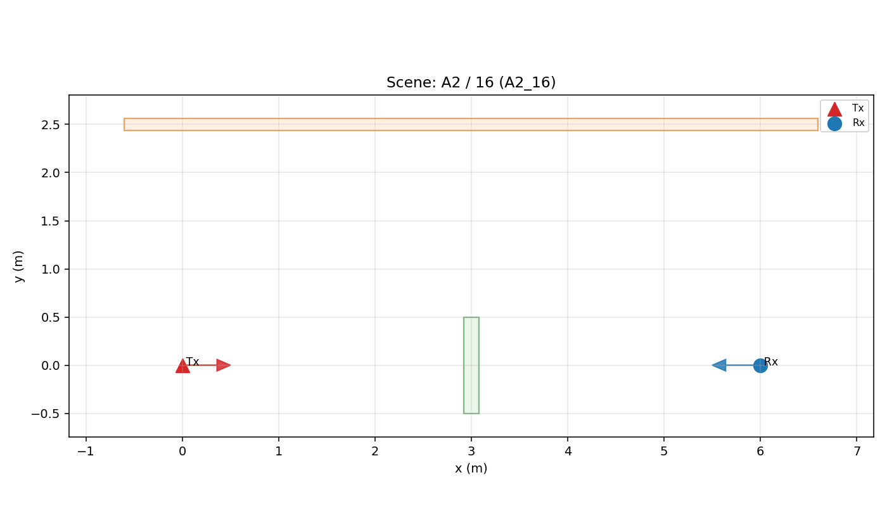

| XPD_early_excess_db | XPD_late_excess_db | L_pol_db | EL_proxy_db | LOSflag |
| --- | --- | --- | --- | --- |
| -31.27 | -23.27 | -8 | 2.72 | 0 |

Top rays

| rank | ray_index | n_bounce | P_lin | tau_ns | los_flag_ray | material_class |
| --- | --- | --- | --- | --- | --- | --- |
| 1 | 0 | 1 | 7.793e-08 | 26.05 | 0 | 1 |

### [WARN] A2/17 (A2_17)

- case_label: A2_17
- scene_source: fallback_layout
- reasons:
  - scene_debug missing -> fallback spatial layout
  - target tau 26.052ns >= Te 10.000ns

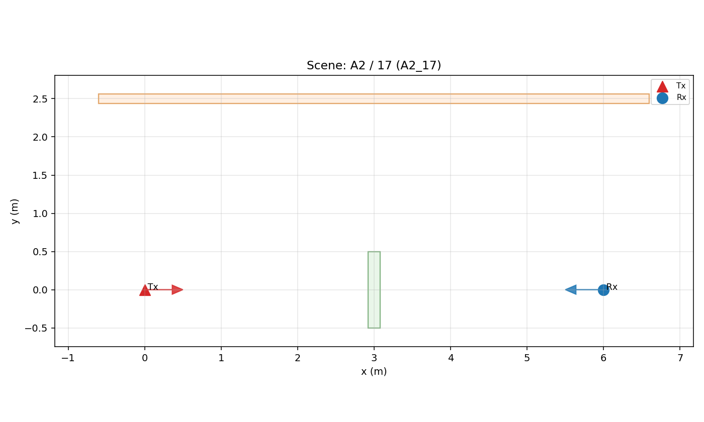

| XPD_early_excess_db | XPD_late_excess_db | L_pol_db | EL_proxy_db | LOSflag |
| --- | --- | --- | --- | --- |
| -31.27 | -23.27 | -8 | 2.72 | 0 |

Top rays

| rank | ray_index | n_bounce | P_lin | tau_ns | los_flag_ray | material_class |
| --- | --- | --- | --- | --- | --- | --- |
| 1 | 0 | 1 | 7.793e-08 | 26.05 | 0 | 1 |

### [WARN] A2/18 (A2_18)

- case_label: A2_18
- scene_source: fallback_layout
- reasons:
  - scene_debug missing -> fallback spatial layout
  - target tau 28.500ns >= Te 10.000ns

| XPD_early_excess_db | XPD_late_excess_db | L_pol_db | EL_proxy_db | LOSflag |
| --- | --- | --- | --- | --- |
| -31.27 | -23.27 | -8 | 2.72 | 0 |

Top rays

| rank | ray_index | n_bounce | P_lin | tau_ns | los_flag_ray | material_class |
| --- | --- | --- | --- | --- | --- | --- |
| 1 | 0 | 1 | 6.512e-08 | 28.5 | 0 | 1 |

### [WARN] A2/19 (A2_19)

- case_label: A2_19
- scene_source: fallback_layout
- reasons:
  - scene_debug missing -> fallback spatial layout
  - target tau 28.500ns >= Te 10.000ns

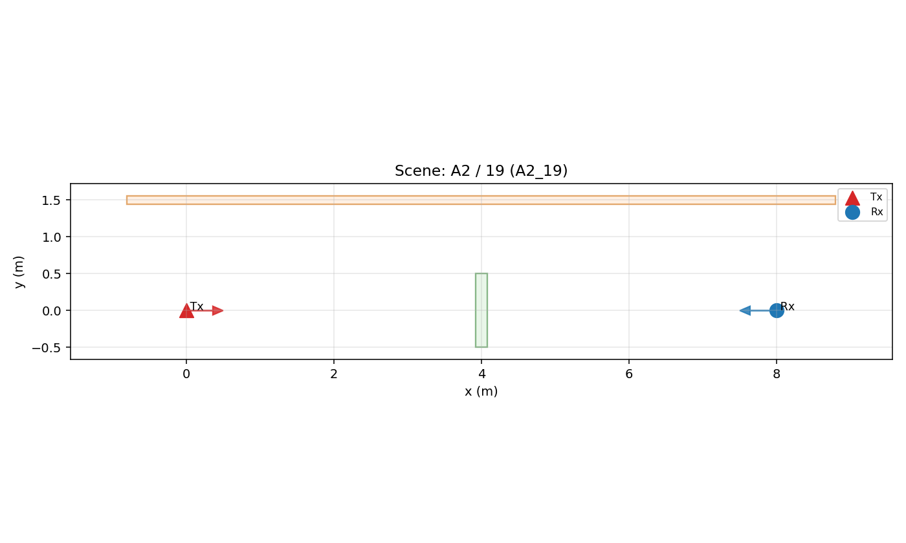

| XPD_early_excess_db | XPD_late_excess_db | L_pol_db | EL_proxy_db | LOSflag |
| --- | --- | --- | --- | --- |
| -31.27 | -23.27 | -8 | 2.72 | 0 |

Top rays

| rank | ray_index | n_bounce | P_lin | tau_ns | los_flag_ray | material_class |
| --- | --- | --- | --- | --- | --- | --- |
| 1 | 0 | 1 | 6.512e-08 | 28.5 | 0 | 1 |

### [WARN] A2/2 (A2_2)

- case_label: A2_2
- scene_source: fallback_layout
- reasons:
  - scene_debug missing -> fallback spatial layout
  - target tau 16.678ns >= Te 10.000ns

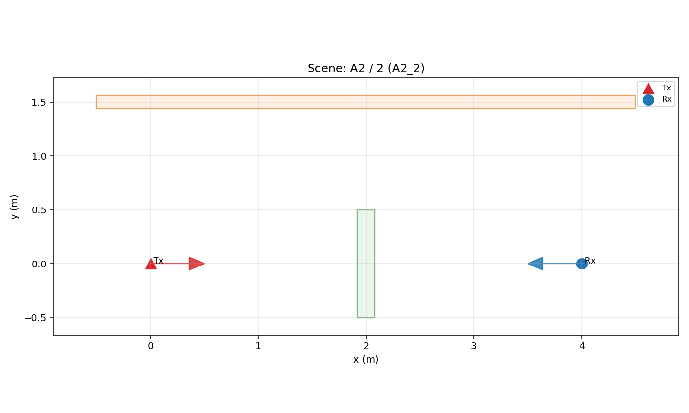

| XPD_early_excess_db | XPD_late_excess_db | L_pol_db | EL_proxy_db | LOSflag |
| --- | --- | --- | --- | --- |
| -31.27 | -23.27 | -8 | 2.72 | 0 |

Top rays

| rank | ray_index | n_bounce | P_lin | tau_ns | los_flag_ray | material_class |
| --- | --- | --- | --- | --- | --- | --- |
| 1 | 0 | 1 | 1.902e-07 | 16.68 | 0 | 1 |

### [WARN] A2/20 (A2_20)

- case_label: A2_20
- scene_source: fallback_layout
- reasons:
  - scene_debug missing -> fallback spatial layout
  - target tau 28.500ns >= Te 10.000ns

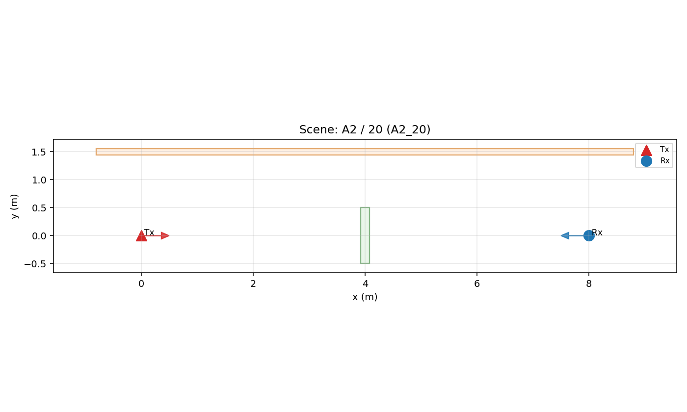

| XPD_early_excess_db | XPD_late_excess_db | L_pol_db | EL_proxy_db | LOSflag |
| --- | --- | --- | --- | --- |
| -31.27 | -23.27 | -8 | 2.72 | 0 |

Top rays

| rank | ray_index | n_bounce | P_lin | tau_ns | los_flag_ray | material_class |
| --- | --- | --- | --- | --- | --- | --- |
| 1 | 0 | 1 | 6.512e-08 | 28.5 | 0 | 1 |

### [WARN] A2/21 (A2_21)

- case_label: A2_21
- scene_source: fallback_layout
- reasons:
  - scene_debug missing -> fallback spatial layout
  - target tau 29.835ns >= Te 10.000ns

| XPD_early_excess_db | XPD_late_excess_db | L_pol_db | EL_proxy_db | LOSflag |
| --- | --- | --- | --- | --- |
| -31.27 | -23.27 | -8 | 2.72 | 0 |

Top rays

| rank | ray_index | n_bounce | P_lin | tau_ns | los_flag_ray | material_class |
| --- | --- | --- | --- | --- | --- | --- |
| 1 | 0 | 1 | 5.942e-08 | 29.83 | 0 | 1 |

### [WARN] A2/22 (A2_22)

- case_label: A2_22
- scene_source: fallback_layout
- reasons:
  - scene_debug missing -> fallback spatial layout
  - target tau 29.835ns >= Te 10.000ns

| XPD_early_excess_db | XPD_late_excess_db | L_pol_db | EL_proxy_db | LOSflag |
| --- | --- | --- | --- | --- |
| -31.27 | -23.27 | -8 | 2.72 | 0 |

Top rays

| rank | ray_index | n_bounce | P_lin | tau_ns | los_flag_ray | material_class |
| --- | --- | --- | --- | --- | --- | --- |
| 1 | 0 | 1 | 5.942e-08 | 29.83 | 0 | 1 |

### [WARN] A2/23 (A2_23)

- case_label: A2_23
- scene_source: fallback_layout
- reasons:
  - scene_debug missing -> fallback spatial layout
  - target tau 29.835ns >= Te 10.000ns

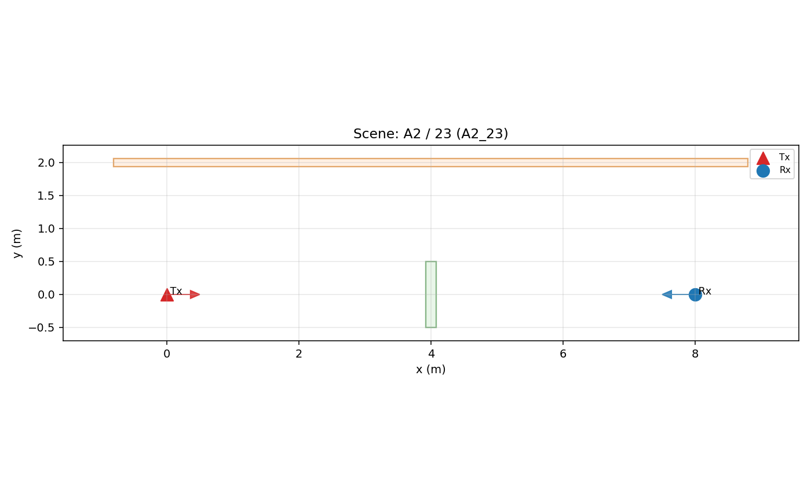

| XPD_early_excess_db | XPD_late_excess_db | L_pol_db | EL_proxy_db | LOSflag |
| --- | --- | --- | --- | --- |
| -31.27 | -23.27 | -8 | 2.72 | 0 |

Top rays

| rank | ray_index | n_bounce | P_lin | tau_ns | los_flag_ray | material_class |
| --- | --- | --- | --- | --- | --- | --- |
| 1 | 0 | 1 | 5.942e-08 | 29.83 | 0 | 1 |

### [WARN] A2/24 (A2_24)

- case_label: A2_24
- scene_source: fallback_layout
- reasons:
  - scene_debug missing -> fallback spatial layout
  - target tau 31.468ns >= Te 10.000ns

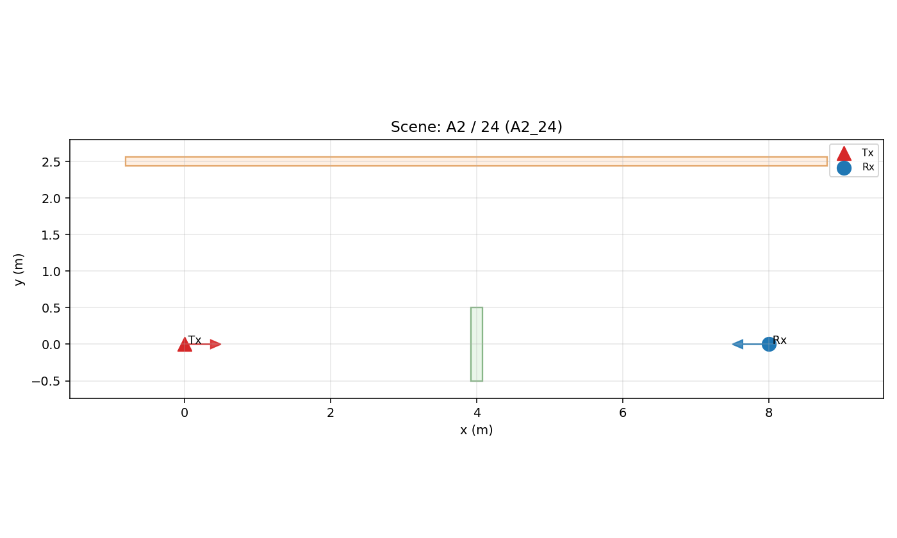

| XPD_early_excess_db | XPD_late_excess_db | L_pol_db | EL_proxy_db | LOSflag |
| --- | --- | --- | --- | --- |
| -31.27 | -23.27 | -8 | 2.72 | 0 |

Top rays

| rank | ray_index | n_bounce | P_lin | tau_ns | los_flag_ray | material_class |
| --- | --- | --- | --- | --- | --- | --- |
| 1 | 0 | 1 | 5.341e-08 | 31.47 | 0 | 1 |

### [WARN] A2/25 (A2_25)

- case_label: A2_25
- scene_source: fallback_layout
- reasons:
  - scene_debug missing -> fallback spatial layout
  - target tau 31.468ns >= Te 10.000ns

| XPD_early_excess_db | XPD_late_excess_db | L_pol_db | EL_proxy_db | LOSflag |
| --- | --- | --- | --- | --- |
| -31.27 | -23.27 | -8 | 2.72 | 0 |

Top rays

| rank | ray_index | n_bounce | P_lin | tau_ns | los_flag_ray | material_class |
| --- | --- | --- | --- | --- | --- | --- |
| 1 | 0 | 1 | 5.341e-08 | 31.47 | 0 | 1 |

### [WARN] A2/26 (A2_26)

- case_label: A2_26
- scene_source: fallback_layout
- reasons:
  - scene_debug missing -> fallback spatial layout
  - target tau 31.468ns >= Te 10.000ns

| XPD_early_excess_db | XPD_late_excess_db | L_pol_db | EL_proxy_db | LOSflag |
| --- | --- | --- | --- | --- |
| -31.27 | -23.27 | -8 | 2.72 | 0 |

Top rays

| rank | ray_index | n_bounce | P_lin | tau_ns | los_flag_ray | material_class |
| --- | --- | --- | --- | --- | --- | --- |
| 1 | 0 | 1 | 5.341e-08 | 31.47 | 0 | 1 |

### [WARN] A2/3 (A2_3)

- case_label: A2_3
- scene_source: fallback_layout
- reasons:
  - scene_debug missing -> fallback spatial layout
  - target tau 18.869ns >= Te 10.000ns

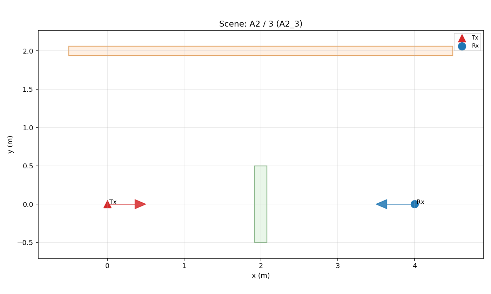

| XPD_early_excess_db | XPD_late_excess_db | L_pol_db | EL_proxy_db | LOSflag |
| --- | --- | --- | --- | --- |
| -31.27 | -23.27 | -8 | 2.72 | 0 |

Top rays

| rank | ray_index | n_bounce | P_lin | tau_ns | los_flag_ray | material_class |
| --- | --- | --- | --- | --- | --- | --- |
| 1 | 0 | 1 | 1.486e-07 | 18.87 | 0 | 1 |

### [WARN] A2/4 (A2_4)

- case_label: A2_4
- scene_source: fallback_layout
- reasons:
  - scene_debug missing -> fallback spatial layout
  - target tau 18.869ns >= Te 10.000ns

| XPD_early_excess_db | XPD_late_excess_db | L_pol_db | EL_proxy_db | LOSflag |
| --- | --- | --- | --- | --- |
| -31.27 | -23.27 | -8 | 2.72 | 0 |

Top rays

| rank | ray_index | n_bounce | P_lin | tau_ns | los_flag_ray | material_class |
| --- | --- | --- | --- | --- | --- | --- |
| 1 | 0 | 1 | 1.486e-07 | 18.87 | 0 | 1 |

### [WARN] A2/5 (A2_5)

- case_label: A2_5
- scene_source: fallback_layout
- reasons:
  - scene_debug missing -> fallback spatial layout
  - target tau 18.869ns >= Te 10.000ns

| XPD_early_excess_db | XPD_late_excess_db | L_pol_db | EL_proxy_db | LOSflag |
| --- | --- | --- | --- | --- |
| -31.27 | -23.27 | -8 | 2.72 | 0 |

Top rays

| rank | ray_index | n_bounce | P_lin | tau_ns | los_flag_ray | material_class |
| --- | --- | --- | --- | --- | --- | --- |
| 1 | 0 | 1 | 1.486e-07 | 18.87 | 0 | 1 |

### [WARN] A2/6 (A2_6)

- case_label: A2_6
- scene_source: fallback_layout
- reasons:
  - scene_debug missing -> fallback spatial layout
  - target tau 21.359ns >= Te 10.000ns

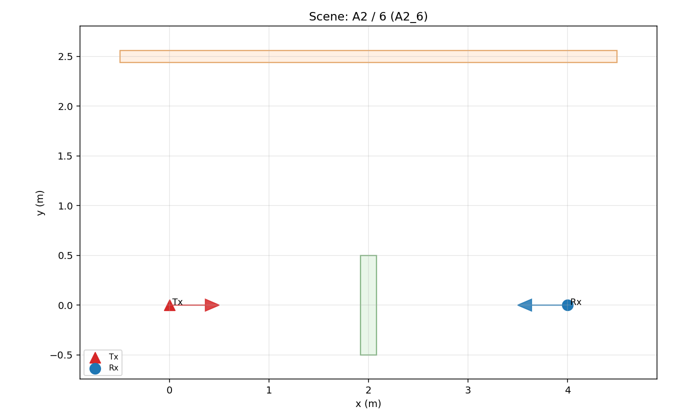

| XPD_early_excess_db | XPD_late_excess_db | L_pol_db | EL_proxy_db | LOSflag |
| --- | --- | --- | --- | --- |
| -31.27 | -23.27 | -8 | 2.72 | 0 |

Top rays

| rank | ray_index | n_bounce | P_lin | tau_ns | los_flag_ray | material_class |
| --- | --- | --- | --- | --- | --- | --- |
| 1 | 0 | 1 | 1.159e-07 | 21.36 | 0 | 1 |

### [WARN] A2/7 (A2_7)

- case_label: A2_7
- scene_source: fallback_layout
- reasons:
  - scene_debug missing -> fallback spatial layout
  - target tau 21.359ns >= Te 10.000ns

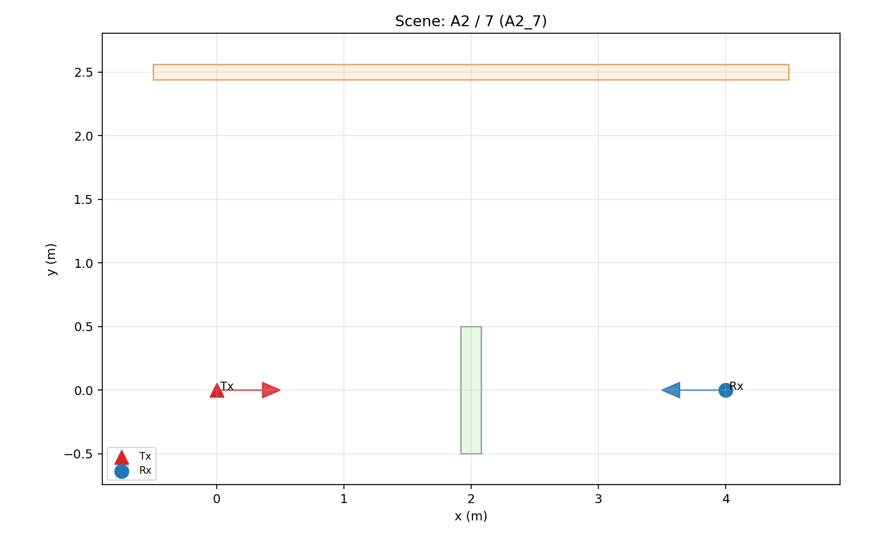

| XPD_early_excess_db | XPD_late_excess_db | L_pol_db | EL_proxy_db | LOSflag |
| --- | --- | --- | --- | --- |
| -31.27 | -23.27 | -8 | 2.72 | 0 |

Top rays

| rank | ray_index | n_bounce | P_lin | tau_ns | los_flag_ray | material_class |
| --- | --- | --- | --- | --- | --- | --- |
| 1 | 0 | 1 | 1.159e-07 | 21.36 | 0 | 1 |

### [WARN] A2/8 (A2_8)

- case_label: A2_8
- scene_source: fallback_layout
- reasons:
  - scene_debug missing -> fallback spatial layout
  - target tau 21.359ns >= Te 10.000ns

| XPD_early_excess_db | XPD_late_excess_db | L_pol_db | EL_proxy_db | LOSflag |
| --- | --- | --- | --- | --- |
| -31.27 | -23.27 | -8 | 2.72 | 0 |

Top rays

| rank | ray_index | n_bounce | P_lin | tau_ns | los_flag_ray | material_class |
| --- | --- | --- | --- | --- | --- | --- |
| 1 | 0 | 1 | 1.159e-07 | 21.36 | 0 | 1 |

### [WARN] A2/9 (A2_9)

- case_label: A2_9
- scene_source: fallback_layout
- reasons:
  - scene_debug missing -> fallback spatial layout
  - target tau 22.376ns >= Te 10.000ns

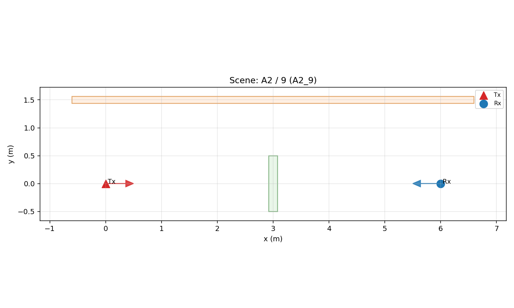

| XPD_early_excess_db | XPD_late_excess_db | L_pol_db | EL_proxy_db | LOSflag |
| --- | --- | --- | --- | --- |
| -31.27 | -23.27 | -8 | 2.72 | 0 |

Top rays

| rank | ray_index | n_bounce | P_lin | tau_ns | los_flag_ray | material_class |
| --- | --- | --- | --- | --- | --- | --- |
| 1 | 0 | 1 | 1.056e-07 | 22.38 | 0 | 1 |

### [WARN] A3/0 (A3_0)

- case_label: A3_0
- scene_source: fallback_layout
- reasons:
  - scene_debug missing -> fallback spatial layout
  - target tau 24.054ns >= Te 10.000ns

| XPD_early_excess_db | XPD_late_excess_db | L_pol_db | EL_proxy_db | LOSflag |
| --- | --- | --- | --- | --- |
| -16.93 | -24.93 | 8 | 2.72 | 0 |

Top rays

| rank | ray_index | n_bounce | P_lin | tau_ns | los_flag_ray | material_class |
| --- | --- | --- | --- | --- | --- | --- |
| 1 | 0 | 2 | 9.142e-08 | 24.05 | 0 | 2|1 |

### [WARN] A3/1 (A3_1)

- case_label: A3_1
- scene_source: fallback_layout
- reasons:
  - scene_debug missing -> fallback spatial layout
  - target tau 24.054ns >= Te 10.000ns

| XPD_early_excess_db | XPD_late_excess_db | L_pol_db | EL_proxy_db | LOSflag |
| --- | --- | --- | --- | --- |
| -16.93 | -24.93 | 8 | 2.72 | 0 |

Top rays

| rank | ray_index | n_bounce | P_lin | tau_ns | los_flag_ray | material_class |
| --- | --- | --- | --- | --- | --- | --- |
| 1 | 0 | 2 | 9.142e-08 | 24.05 | 0 | 2|1 |

### [WARN] A3/10 (A3_10)

- case_label: A3_10
- scene_source: fallback_layout
- reasons:
  - scene_debug missing -> fallback spatial layout
  - target tau 25.825ns >= Te 10.000ns

| XPD_early_excess_db | XPD_late_excess_db | L_pol_db | EL_proxy_db | LOSflag |
| --- | --- | --- | --- | --- |
| -16.93 | -24.93 | 8 | 2.72 | 0 |

Top rays

| rank | ray_index | n_bounce | P_lin | tau_ns | los_flag_ray | material_class |
| --- | --- | --- | --- | --- | --- | --- |
| 1 | 0 | 2 | 7.931e-08 | 25.82 | 0 | 2|1 |

### [WARN] A3/11 (A3_11)

- case_label: A3_11
- scene_source: fallback_layout
- reasons:
  - scene_debug missing -> fallback spatial layout
  - target tau 25.825ns >= Te 10.000ns

| XPD_early_excess_db | XPD_late_excess_db | L_pol_db | EL_proxy_db | LOSflag |
| --- | --- | --- | --- | --- |
| -16.93 | -24.93 | 8 | 2.72 | 0 |

Top rays

| rank | ray_index | n_bounce | P_lin | tau_ns | los_flag_ray | material_class |
| --- | --- | --- | --- | --- | --- | --- |
| 1 | 0 | 2 | 7.931e-08 | 25.82 | 0 | 2|1 |

### [WARN] A3/18 (A3_18)

- case_label: A3_18
- scene_source: fallback_layout
- reasons:
  - scene_debug missing -> fallback spatial layout
  - target tau 24.449ns >= Te 10.000ns

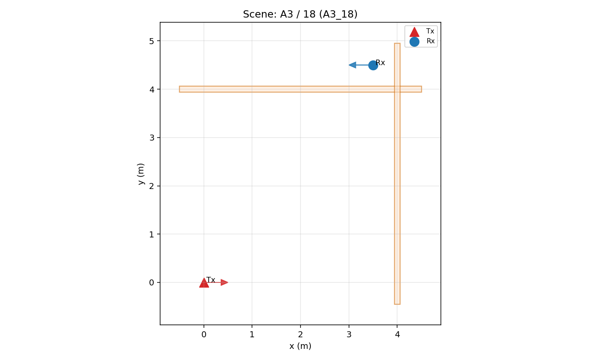

| XPD_early_excess_db | XPD_late_excess_db | L_pol_db | EL_proxy_db | LOSflag |
| --- | --- | --- | --- | --- |
| -27.9 | -24.93 | -2.965 | -1.679 | 0 |

Top rays

| rank | ray_index | n_bounce | P_lin | tau_ns | los_flag_ray | material_class |
| --- | --- | --- | --- | --- | --- | --- |
| 1 | 0 | 1 | 1.174e-07 | 21.23 | 0 | 1 |
| 2 | 1 | 1 | 1.174e-07 | 21.23 | 0 | 2 |
| 3 | 2 | 2 | 8.849e-08 | 24.45 | 0 | 2|1 |

### [WARN] A3/19 (A3_19)

- case_label: A3_19
- scene_source: fallback_layout
- reasons:
  - scene_debug missing -> fallback spatial layout
  - target tau 24.449ns >= Te 10.000ns

| XPD_early_excess_db | XPD_late_excess_db | L_pol_db | EL_proxy_db | LOSflag |
| --- | --- | --- | --- | --- |
| -27.9 | -24.93 | -2.965 | -1.679 | 0 |

Top rays

| rank | ray_index | n_bounce | P_lin | tau_ns | los_flag_ray | material_class |
| --- | --- | --- | --- | --- | --- | --- |
| 1 | 0 | 1 | 1.174e-07 | 21.23 | 0 | 1 |
| 2 | 1 | 1 | 1.174e-07 | 21.23 | 0 | 2 |
| 3 | 2 | 2 | 8.849e-08 | 24.45 | 0 | 2|1 |

### [WARN] A3/20 (A3_20)

- case_label: A3_20
- scene_source: fallback_layout
- reasons:
  - scene_debug missing -> fallback spatial layout
  - target tau 27.797ns >= Te 10.000ns

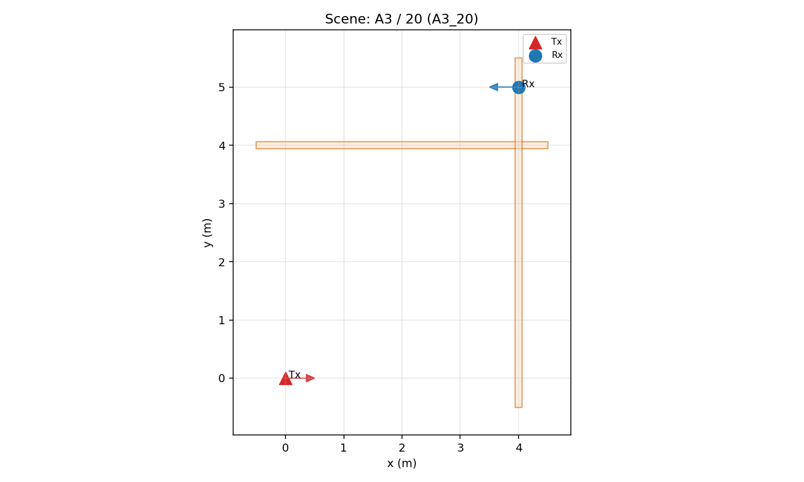

| XPD_early_excess_db | XPD_late_excess_db | L_pol_db | EL_proxy_db | LOSflag |
| --- | --- | --- | --- | --- |
| -16.93 | -24.93 | 8 | 2.72 | 0 |

Top rays

| rank | ray_index | n_bounce | P_lin | tau_ns | los_flag_ray | material_class |
| --- | --- | --- | --- | --- | --- | --- |
| 1 | 0 | 2 | 6.846e-08 | 27.8 | 0 | 2|1 |

### [WARN] A3/21 (A3_21)

- case_label: A3_21
- scene_source: fallback_layout
- reasons:
  - scene_debug missing -> fallback spatial layout
  - target tau 27.797ns >= Te 10.000ns

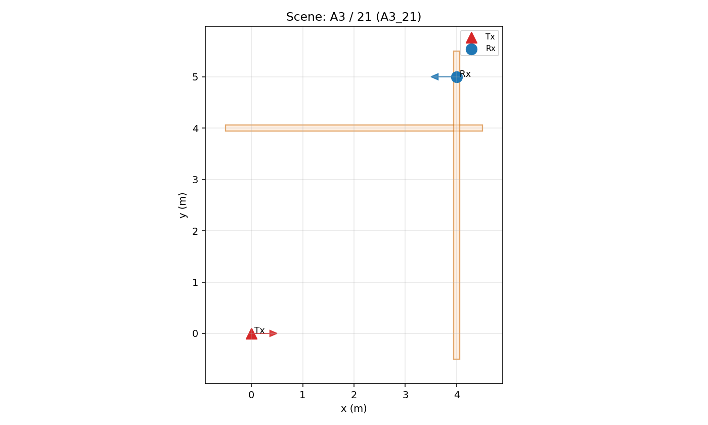

| XPD_early_excess_db | XPD_late_excess_db | L_pol_db | EL_proxy_db | LOSflag |
| --- | --- | --- | --- | --- |
| -16.93 | -24.93 | 8 | 2.72 | 0 |

Top rays

| rank | ray_index | n_bounce | P_lin | tau_ns | los_flag_ray | material_class |
| --- | --- | --- | --- | --- | --- | --- |
| 1 | 0 | 2 | 6.846e-08 | 27.8 | 0 | 2|1 |

### [WARN] A3/22 (A3_22)

- case_label: A3_22
- scene_source: fallback_layout
- reasons:
  - scene_debug missing -> fallback spatial layout
  - target tau 22.795ns >= Te 10.000ns

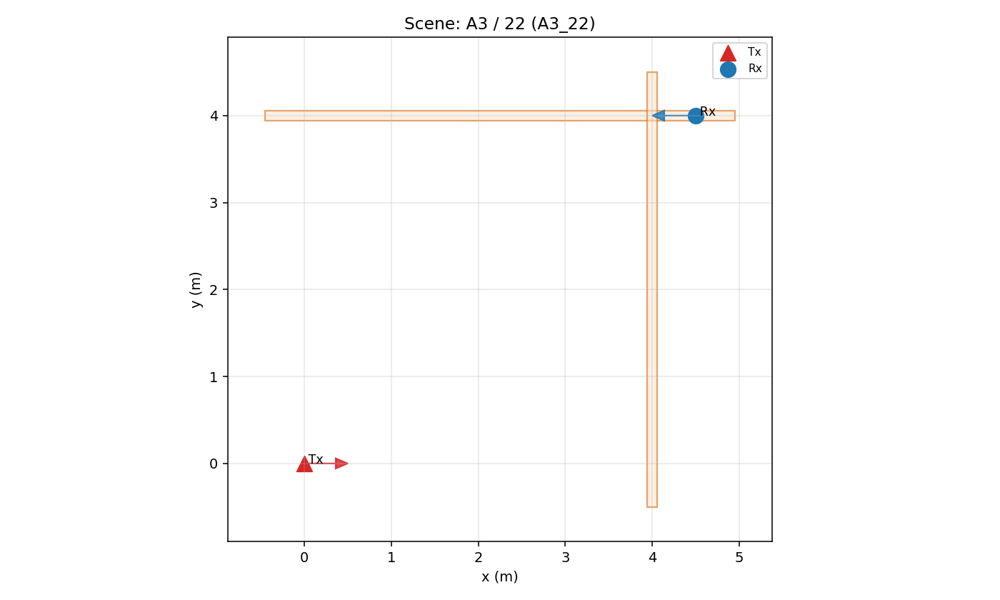

| XPD_early_excess_db | XPD_late_excess_db | L_pol_db | EL_proxy_db | LOSflag |
| --- | --- | --- | --- | --- |
| -16.93 | -24.93 | 8 | 2.72 | 0 |

Top rays

| rank | ray_index | n_bounce | P_lin | tau_ns | los_flag_ray | material_class |
| --- | --- | --- | --- | --- | --- | --- |
| 1 | 0 | 2 | 1.018e-07 | 22.79 | 0 | 1|2 |

### [WARN] A3/23 (A3_23)

- case_label: A3_23
- scene_source: fallback_layout
- reasons:
  - scene_debug missing -> fallback spatial layout
  - target tau 22.795ns >= Te 10.000ns

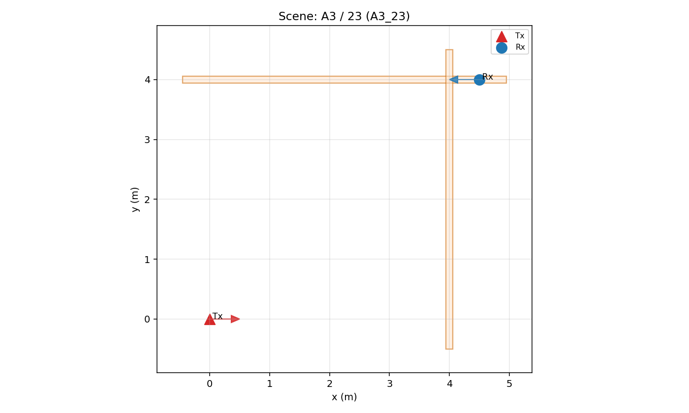

| XPD_early_excess_db | XPD_late_excess_db | L_pol_db | EL_proxy_db | LOSflag |
| --- | --- | --- | --- | --- |
| -16.93 | -24.93 | 8 | 2.72 | 0 |

Top rays

| rank | ray_index | n_bounce | P_lin | tau_ns | los_flag_ray | material_class |
| --- | --- | --- | --- | --- | --- | --- |
| 1 | 0 | 2 | 1.018e-07 | 22.79 | 0 | 1|2 |

### [WARN] A3/8 (A3_8)

- case_label: A3_8
- scene_source: fallback_layout
- reasons:
  - scene_debug missing -> fallback spatial layout
  - target tau 22.238ns >= Te 10.000ns

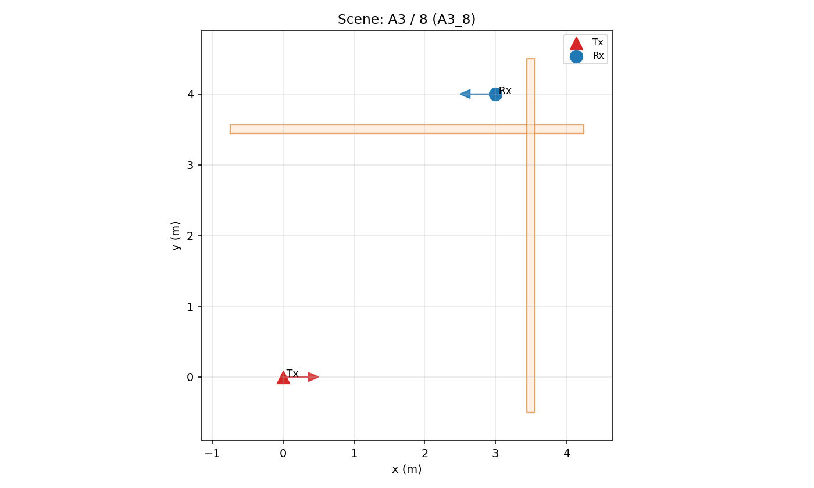

| XPD_early_excess_db | XPD_late_excess_db | L_pol_db | EL_proxy_db | LOSflag |
| --- | --- | --- | --- | --- |
| -28.03 | -24.93 | -3.094 | -1.626 | 0 |

Top rays

| rank | ray_index | n_bounce | P_lin | tau_ns | los_flag_ray | material_class |
| --- | --- | --- | --- | --- | --- | --- |
| 1 | 0 | 1 | 1.486e-07 | 18.87 | 0 | 1 |
| 2 | 1 | 1 | 1.486e-07 | 18.87 | 0 | 2 |
| 3 | 2 | 2 | 1.07e-07 | 22.24 | 0 | 2|1 |

### [WARN] A3/9 (A3_9)

- case_label: A3_9
- scene_source: fallback_layout
- reasons:
  - scene_debug missing -> fallback spatial layout
  - target tau 22.238ns >= Te 10.000ns

| XPD_early_excess_db | XPD_late_excess_db | L_pol_db | EL_proxy_db | LOSflag |
| --- | --- | --- | --- | --- |
| -28.03 | -24.93 | -3.094 | -1.626 | 0 |

Top rays

| rank | ray_index | n_bounce | P_lin | tau_ns | los_flag_ray | material_class |
| --- | --- | --- | --- | --- | --- | --- |
| 1 | 0 | 1 | 1.486e-07 | 18.87 | 0 | 1 |
| 2 | 1 | 1 | 1.486e-07 | 18.87 | 0 | 2 |
| 3 | 2 | 2 | 1.07e-07 | 22.24 | 0 | 2|1 |

### [WARN] A4/0 (A4_0)

- case_label: A4_0
- scene_source: fallback_layout
- reasons:
  - scene_debug missing -> fallback spatial layout

| XPD_early_excess_db | XPD_late_excess_db | L_pol_db | EL_proxy_db | LOSflag |
| --- | --- | --- | --- | --- |
| -34.86 | -24.93 | -9.922 | 8.343 | 0 |

Top rays

| rank | ray_index | n_bounce | P_lin | tau_ns | los_flag_ray | material_class |
| --- | --- | --- | --- | --- | --- | --- |
| 1 | 0 | 1 | 1.302e-07 | 10.55 | 0 | 1 |

### [WARN] A4/1 (A4_1)

- case_label: A4_1
- scene_source: fallback_layout
- reasons:
  - scene_debug missing -> fallback spatial layout

| XPD_early_excess_db | XPD_late_excess_db | L_pol_db | EL_proxy_db | LOSflag |
| --- | --- | --- | --- | --- |
| -34.81 | -24.93 | -9.87 | 8.343 | 0 |

Top rays

| rank | ray_index | n_bounce | P_lin | tau_ns | los_flag_ray | material_class |
| --- | --- | --- | --- | --- | --- | --- |
| 1 | 0 | 1 | 1.302e-07 | 10.55 | 0 | 1 |

### [WARN] A4/10 (A4_10)

- case_label: A4_10
- scene_source: fallback_layout
- reasons:
  - scene_debug missing -> fallback spatial layout

| XPD_early_excess_db | XPD_late_excess_db | L_pol_db | EL_proxy_db | LOSflag |
| --- | --- | --- | --- | --- |
| -34.71 | -24.93 | -9.772 | 8.343 | 0 |

Top rays

| rank | ray_index | n_bounce | P_lin | tau_ns | los_flag_ray | material_class |
| --- | --- | --- | --- | --- | --- | --- |
| 1 | 0 | 1 | 1.447e-08 | 31.64 | 0 | 1 |

### [WARN] A4/11 (A4_11)

- case_label: A4_11
- scene_source: fallback_layout
- reasons:
  - scene_debug missing -> fallback spatial layout

| XPD_early_excess_db | XPD_late_excess_db | L_pol_db | EL_proxy_db | LOSflag |
| --- | --- | --- | --- | --- |
| -34.84 | -24.93 | -9.905 | 8.343 | 0 |

Top rays

| rank | ray_index | n_bounce | P_lin | tau_ns | los_flag_ray | material_class |
| --- | --- | --- | --- | --- | --- | --- |
| 1 | 0 | 1 | 1.447e-08 | 31.64 | 0 | 1 |

### [WARN] A4/12 (A4_12)

- case_label: A4_12
- scene_source: fallback_layout
- reasons:
  - scene_debug missing -> fallback spatial layout

| XPD_early_excess_db | XPD_late_excess_db | L_pol_db | EL_proxy_db | LOSflag |
| --- | --- | --- | --- | --- |
| -33.1 | -24.93 | -8.165 | 9.96 | 0 |

Top rays

| rank | ray_index | n_bounce | P_lin | tau_ns | los_flag_ray | material_class |
| --- | --- | --- | --- | --- | --- | --- |
| 1 | 0 | 1 | 2.64e-08 | 19.45 | 0 | 1 |

### [WARN] A4/13 (A4_13)

- case_label: A4_13
- scene_source: fallback_layout
- reasons:
  - scene_debug missing -> fallback spatial layout

| XPD_early_excess_db | XPD_late_excess_db | L_pol_db | EL_proxy_db | LOSflag |
| --- | --- | --- | --- | --- |
| -33.52 | -24.93 | -8.586 | 9.96 | 0 |

Top rays

| rank | ray_index | n_bounce | P_lin | tau_ns | los_flag_ray | material_class |
| --- | --- | --- | --- | --- | --- | --- |
| 1 | 0 | 1 | 2.64e-08 | 19.45 | 0 | 1 |

### [WARN] A4/14 (A4_14)

- case_label: A4_14
- scene_source: fallback_layout
- reasons:
  - scene_debug missing -> fallback spatial layout

| XPD_early_excess_db | XPD_late_excess_db | L_pol_db | EL_proxy_db | LOSflag |
| --- | --- | --- | --- | --- |
| -33.9 | -24.93 | -8.962 | 9.824 | 0 |

Top rays

| rank | ray_index | n_bounce | P_lin | tau_ns | los_flag_ray | material_class |
| --- | --- | --- | --- | --- | --- | --- |
| 1 | 0 | 1 | 1.518e-08 | 26.05 | 0 | 1 |

### [WARN] A4/15 (A4_15)

- case_label: A4_15
- scene_source: fallback_layout
- reasons:
  - scene_debug missing -> fallback spatial layout

| XPD_early_excess_db | XPD_late_excess_db | L_pol_db | EL_proxy_db | LOSflag |
| --- | --- | --- | --- | --- |
| -34 | -24.93 | -9.065 | 9.824 | 0 |

Top rays

| rank | ray_index | n_bounce | P_lin | tau_ns | los_flag_ray | material_class |
| --- | --- | --- | --- | --- | --- | --- |
| 1 | 0 | 1 | 1.518e-08 | 26.05 | 0 | 1 |

### [WARN] A4/16 (A4_16)

- case_label: A4_16
- scene_source: fallback_layout
- reasons:
  - scene_debug missing -> fallback spatial layout

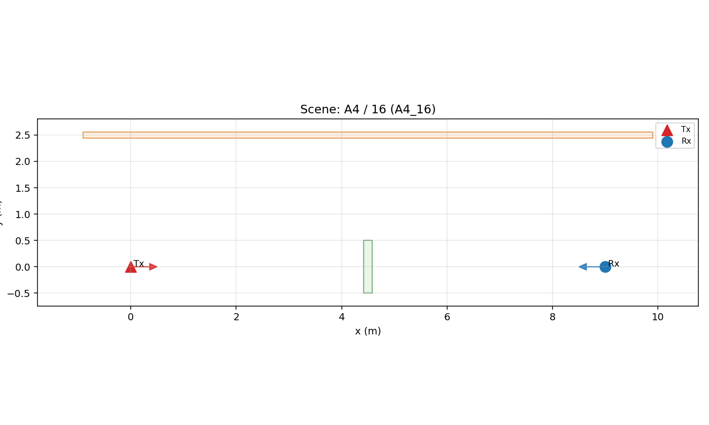

| XPD_early_excess_db | XPD_late_excess_db | L_pol_db | EL_proxy_db | LOSflag |
| --- | --- | --- | --- | --- |
| -34.37 | -24.93 | -9.437 | 9.413 | 0 |

Top rays

| rank | ray_index | n_bounce | P_lin | tau_ns | los_flag_ray | material_class |
| --- | --- | --- | --- | --- | --- | --- |
| 1 | 0 | 1 | 9.604e-09 | 34.34 | 0 | 1 |

### [WARN] A4/17 (A4_17)

- case_label: A4_17
- scene_source: fallback_layout
- reasons:
  - scene_debug missing -> fallback spatial layout

| XPD_early_excess_db | XPD_late_excess_db | L_pol_db | EL_proxy_db | LOSflag |
| --- | --- | --- | --- | --- |
| -34.42 | -24.93 | -9.483 | 9.413 | 0 |

Top rays

| rank | ray_index | n_bounce | P_lin | tau_ns | los_flag_ray | material_class |
| --- | --- | --- | --- | --- | --- | --- |
| 1 | 0 | 1 | 9.604e-09 | 34.34 | 0 | 1 |

### [WARN] A4/18 (A4_18)

- case_label: A4_18
- scene_source: fallback_layout
- reasons:
  - scene_debug missing -> fallback spatial layout

| XPD_early_excess_db | XPD_late_excess_db | L_pol_db | EL_proxy_db | LOSflag |
| --- | --- | --- | --- | --- |
| -33.41 | -24.93 | -8.48 | 9.95 | 0 |

Top rays

| rank | ray_index | n_bounce | P_lin | tau_ns | los_flag_ray | material_class |
| --- | --- | --- | --- | --- | --- | --- |
| 1 | 0 | 1 | 1.551e-08 | 25.4 | 0 | 1 |

### [WARN] A4/19 (A4_19)

- case_label: A4_19
- scene_source: fallback_layout
- reasons:
  - scene_debug missing -> fallback spatial layout

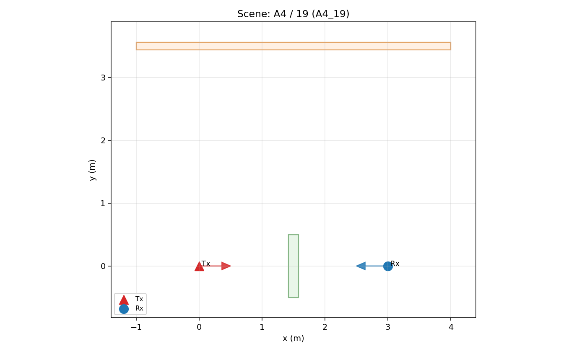

| XPD_early_excess_db | XPD_late_excess_db | L_pol_db | EL_proxy_db | LOSflag |
| --- | --- | --- | --- | --- |
| -33.54 | -24.93 | -8.606 | 9.95 | 0 |

Top rays

| rank | ray_index | n_bounce | P_lin | tau_ns | los_flag_ray | material_class |
| --- | --- | --- | --- | --- | --- | --- |
| 1 | 0 | 1 | 1.551e-08 | 25.4 | 0 | 1 |

### [WARN] A4/2 (A4_2)

- case_label: A4_2
- scene_source: fallback_layout
- reasons:
  - scene_debug missing -> fallback spatial layout

| XPD_early_excess_db | XPD_late_excess_db | L_pol_db | EL_proxy_db | LOSflag |
| --- | --- | --- | --- | --- |
| -35.29 | -24.93 | -10.35 | 6.423 | 0 |

Top rays

| rank | ray_index | n_bounce | P_lin | tau_ns | los_flag_ray | material_class |
| --- | --- | --- | --- | --- | --- | --- |
| 1 | 0 | 1 | 5.477e-08 | 20.29 | 0 | 1 |

### [WARN] A4/20 (A4_20)

- case_label: A4_20
- scene_source: fallback_layout
- reasons:
  - scene_debug missing -> fallback spatial layout

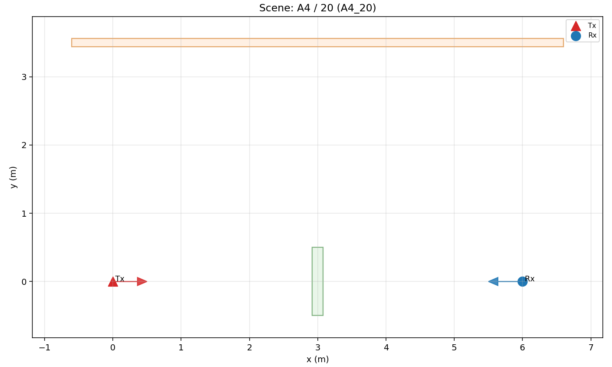

| XPD_early_excess_db | XPD_late_excess_db | L_pol_db | EL_proxy_db | LOSflag |
| --- | --- | --- | --- | --- |
| -33.83 | -24.93 | -8.894 | 9.94 | 0 |

Top rays

| rank | ray_index | n_bounce | P_lin | tau_ns | los_flag_ray | material_class |
| --- | --- | --- | --- | --- | --- | --- |
| 1 | 0 | 1 | 1.061e-08 | 30.75 | 0 | 1 |

### [WARN] A4/21 (A4_21)

- case_label: A4_21
- scene_source: fallback_layout
- reasons:
  - scene_debug missing -> fallback spatial layout

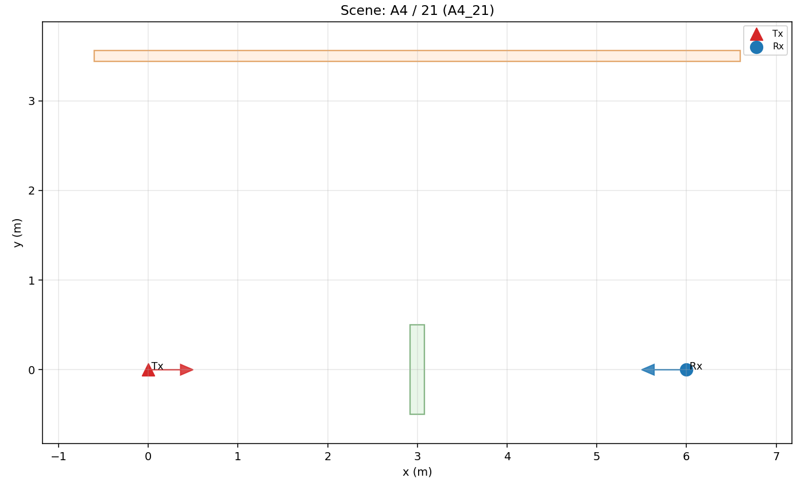

| XPD_early_excess_db | XPD_late_excess_db | L_pol_db | EL_proxy_db | LOSflag |
| --- | --- | --- | --- | --- |
| -34.13 | -24.93 | -9.193 | 9.94 | 0 |

Top rays

| rank | ray_index | n_bounce | P_lin | tau_ns | los_flag_ray | material_class |
| --- | --- | --- | --- | --- | --- | --- |
| 1 | 0 | 1 | 1.061e-08 | 30.75 | 0 | 1 |

### [WARN] A4/22 (A4_22)

- case_label: A4_22
- scene_source: fallback_layout
- reasons:
  - scene_debug missing -> fallback spatial layout

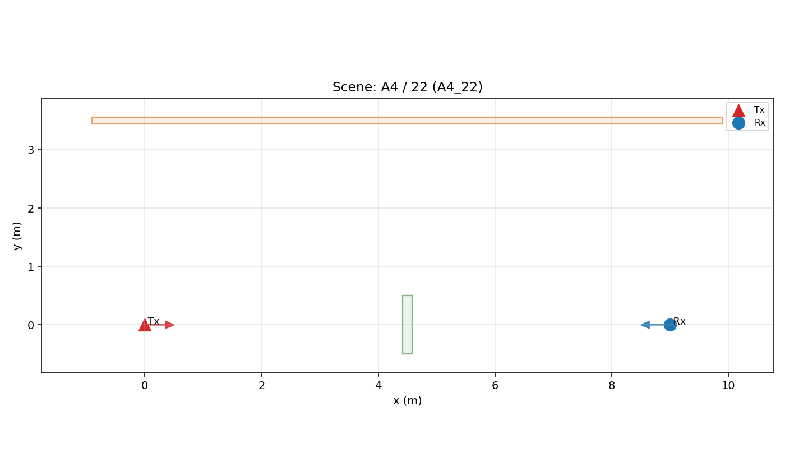

| XPD_early_excess_db | XPD_late_excess_db | L_pol_db | EL_proxy_db | LOSflag |
| --- | --- | --- | --- | --- |
| -34.07 | -24.93 | -9.137 | 9.779 | 0 |

Top rays

| rank | ray_index | n_bounce | P_lin | tau_ns | los_flag_ray | material_class |
| --- | --- | --- | --- | --- | --- | --- |
| 1 | 0 | 1 | 7.198e-09 | 38.03 | 0 | 1 |

### [WARN] A4/23 (A4_23)

- case_label: A4_23
- scene_source: fallback_layout
- reasons:
  - scene_debug missing -> fallback spatial layout

| XPD_early_excess_db | XPD_late_excess_db | L_pol_db | EL_proxy_db | LOSflag |
| --- | --- | --- | --- | --- |
| -34.28 | -24.93 | -9.341 | 9.779 | 0 |

Top rays

| rank | ray_index | n_bounce | P_lin | tau_ns | los_flag_ray | material_class |
| --- | --- | --- | --- | --- | --- | --- |
| 1 | 0 | 1 | 7.198e-09 | 38.03 | 0 | 1 |

### [WARN] A4/24 (A4_24)

- case_label: A4_24
- scene_source: fallback_layout
- reasons:
  - scene_debug missing -> fallback spatial layout

| XPD_early_excess_db | XPD_late_excess_db | L_pol_db | EL_proxy_db | LOSflag |
| --- | --- | --- | --- | --- |
| -26.96 | -24.93 | -2.023 | 10.16 | 0 |

Top rays

| rank | ray_index | n_bounce | P_lin | tau_ns | los_flag_ray | material_class |
| --- | --- | --- | --- | --- | --- | --- |
| 1 | 0 | 1 | 8.569e-08 | 10.55 | 0 | 1 |

### [WARN] A4/25 (A4_25)

- case_label: A4_25
- scene_source: fallback_layout
- reasons:
  - scene_debug missing -> fallback spatial layout

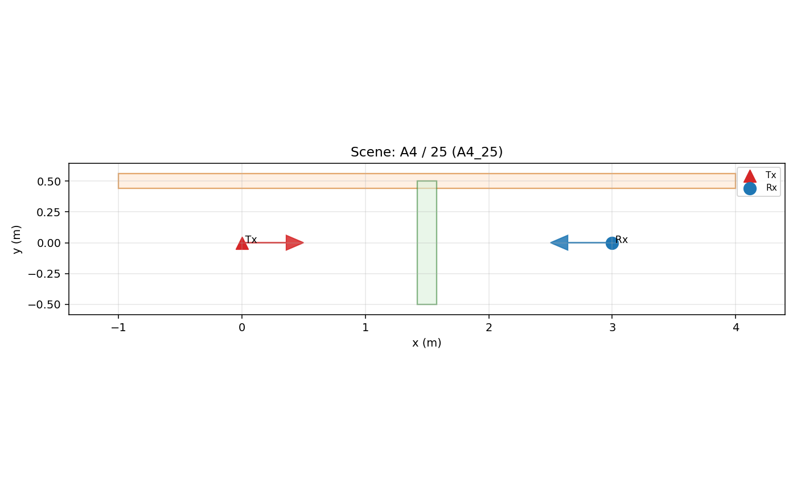

| XPD_early_excess_db | XPD_late_excess_db | L_pol_db | EL_proxy_db | LOSflag |
| --- | --- | --- | --- | --- |
| -26.8 | -24.93 | -1.861 | 10.16 | 0 |

Top rays

| rank | ray_index | n_bounce | P_lin | tau_ns | los_flag_ray | material_class |
| --- | --- | --- | --- | --- | --- | --- |
| 1 | 0 | 1 | 8.569e-08 | 10.55 | 0 | 1 |

### [WARN] A4/26 (A4_26)

- case_label: A4_26
- scene_source: fallback_layout
- reasons:
  - scene_debug missing -> fallback spatial layout

| XPD_early_excess_db | XPD_late_excess_db | L_pol_db | EL_proxy_db | LOSflag |
| --- | --- | --- | --- | --- |
| -27 | -24.93 | -2.064 | 6.769 | 0 |

Top rays

| rank | ray_index | n_bounce | P_lin | tau_ns | los_flag_ray | material_class |
| --- | --- | --- | --- | --- | --- | --- |
| 1 | 0 | 1 | 5.058e-08 | 20.29 | 0 | 1 |

### [WARN] A4/27 (A4_27)

- case_label: A4_27
- scene_source: fallback_layout
- reasons:
  - scene_debug missing -> fallback spatial layout

| XPD_early_excess_db | XPD_late_excess_db | L_pol_db | EL_proxy_db | LOSflag |
| --- | --- | --- | --- | --- |
| -26.96 | -24.93 | -2.029 | 6.769 | 0 |

Top rays

| rank | ray_index | n_bounce | P_lin | tau_ns | los_flag_ray | material_class |
| --- | --- | --- | --- | --- | --- | --- |
| 1 | 0 | 1 | 5.058e-08 | 20.29 | 0 | 1 |

### [WARN] A4/28 (A4_28)

- case_label: A4_28
- scene_source: fallback_layout
- reasons:
  - scene_debug missing -> fallback spatial layout

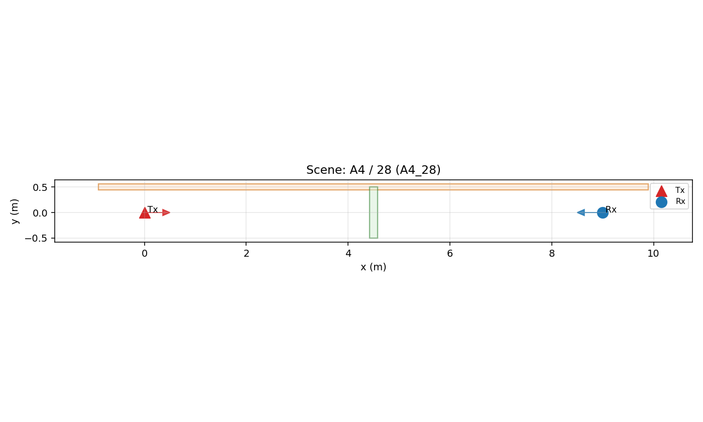

| XPD_early_excess_db | XPD_late_excess_db | L_pol_db | EL_proxy_db | LOSflag |
| --- | --- | --- | --- | --- |
| -27.19 | -24.93 | -2.254 | 5.485 | 0 |

Top rays

| rank | ray_index | n_bounce | P_lin | tau_ns | los_flag_ray | material_class |
| --- | --- | --- | --- | --- | --- | --- |
| 1 | 0 | 1 | 3.067e-08 | 30.21 | 0 | 1 |

### [WARN] A4/29 (A4_29)

- case_label: A4_29
- scene_source: fallback_layout
- reasons:
  - scene_debug missing -> fallback spatial layout

| XPD_early_excess_db | XPD_late_excess_db | L_pol_db | EL_proxy_db | LOSflag |
| --- | --- | --- | --- | --- |
| -27.32 | -24.93 | -2.389 | 5.485 | 0 |

Top rays

| rank | ray_index | n_bounce | P_lin | tau_ns | los_flag_ray | material_class |
| --- | --- | --- | --- | --- | --- | --- |
| 1 | 0 | 1 | 3.067e-08 | 30.21 | 0 | 1 |

### [WARN] A4/3 (A4_3)

- case_label: A4_3
- scene_source: fallback_layout
- reasons:
  - scene_debug missing -> fallback spatial layout

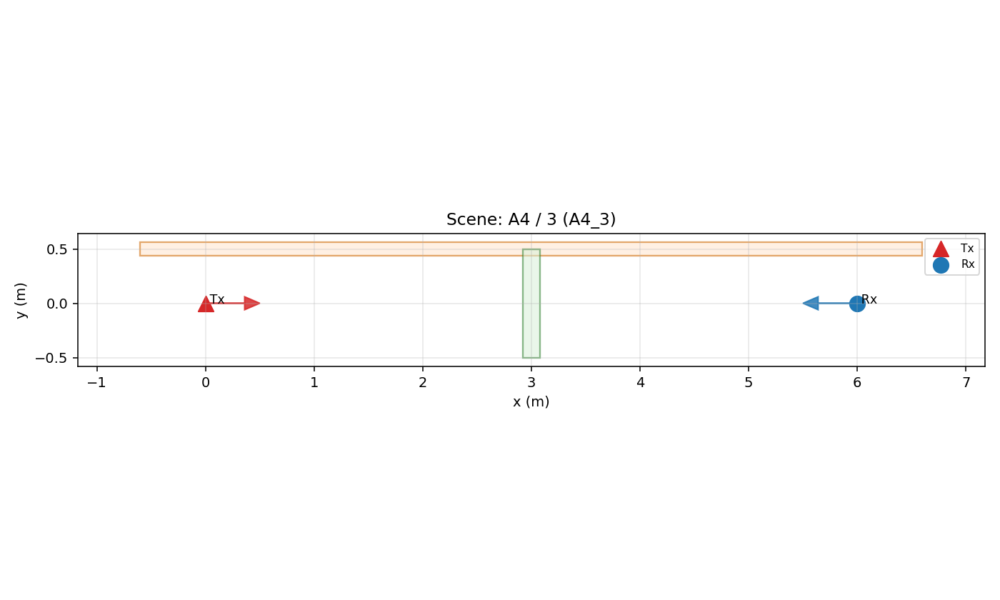

| XPD_early_excess_db | XPD_late_excess_db | L_pol_db | EL_proxy_db | LOSflag |
| --- | --- | --- | --- | --- |
| -35.18 | -24.93 | -10.24 | 6.423 | 0 |

Top rays

| rank | ray_index | n_bounce | P_lin | tau_ns | los_flag_ray | material_class |
| --- | --- | --- | --- | --- | --- | --- |
| 1 | 0 | 1 | 5.477e-08 | 20.29 | 0 | 1 |

### [WARN] A4/30 (A4_30)

- case_label: A4_30
- scene_source: fallback_layout
- reasons:
  - scene_debug missing -> fallback spatial layout

| XPD_early_excess_db | XPD_late_excess_db | L_pol_db | EL_proxy_db | LOSflag |
| --- | --- | --- | --- | --- |
| -25.6 | -24.93 | -0.6629 | 16.17 | 0 |

Top rays

| rank | ray_index | n_bounce | P_lin | tau_ns | los_flag_ray | material_class |
| --- | --- | --- | --- | --- | --- | --- |
| 1 | 0 | 1 | 1.193e-08 | 14.15 | 0 | 1 |

### [WARN] A4/31 (A4_31)

- case_label: A4_31
- scene_source: fallback_layout
- reasons:
  - scene_debug missing -> fallback spatial layout

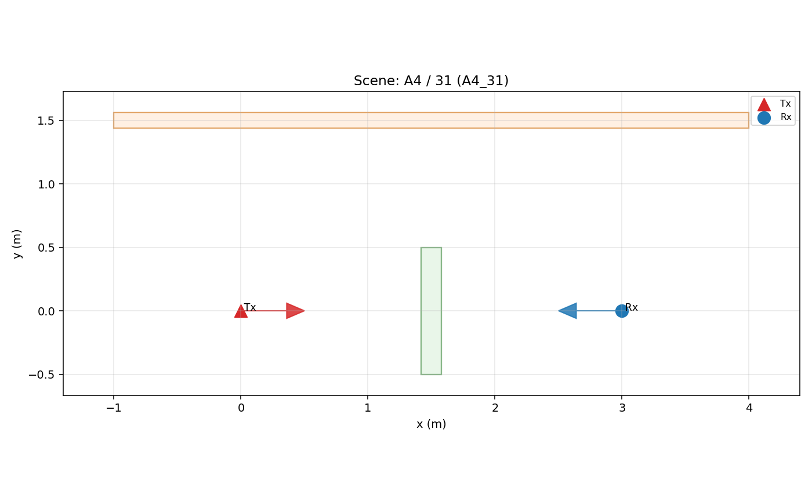

| XPD_early_excess_db | XPD_late_excess_db | L_pol_db | EL_proxy_db | LOSflag |
| --- | --- | --- | --- | --- |
| -25.76 | -24.93 | -0.823 | 16.17 | 0 |

Top rays

| rank | ray_index | n_bounce | P_lin | tau_ns | los_flag_ray | material_class |
| --- | --- | --- | --- | --- | --- | --- |
| 1 | 0 | 1 | 1.193e-08 | 14.15 | 0 | 1 |

### [WARN] A4/32 (A4_32)

- case_label: A4_32
- scene_source: fallback_layout
- reasons:
  - scene_debug missing -> fallback spatial layout

| XPD_early_excess_db | XPD_late_excess_db | L_pol_db | EL_proxy_db | LOSflag |
| --- | --- | --- | --- | --- |
| -26.42 | -24.93 | -1.489 | 12.75 | 0 |

Top rays

| rank | ray_index | n_bounce | P_lin | tau_ns | los_flag_ray | material_class |
| --- | --- | --- | --- | --- | --- | --- |
| 1 | 0 | 1 | 1.05e-08 | 22.38 | 0 | 1 |

### [WARN] A4/33 (A4_33)

- case_label: A4_33
- scene_source: fallback_layout
- reasons:
  - scene_debug missing -> fallback spatial layout

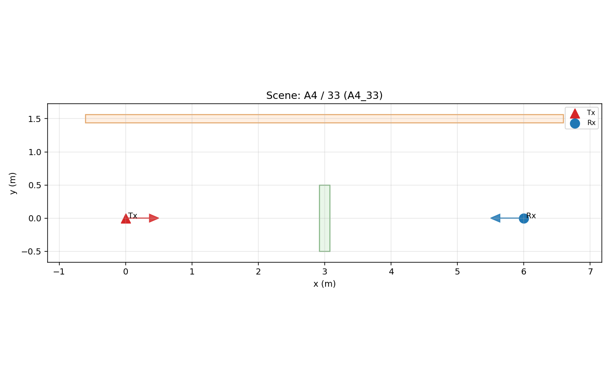

| XPD_early_excess_db | XPD_late_excess_db | L_pol_db | EL_proxy_db | LOSflag |
| --- | --- | --- | --- | --- |
| -26.56 | -24.93 | -1.629 | 12.75 | 0 |

Top rays

| rank | ray_index | n_bounce | P_lin | tau_ns | los_flag_ray | material_class |
| --- | --- | --- | --- | --- | --- | --- |
| 1 | 0 | 1 | 1.05e-08 | 22.38 | 0 | 1 |

### [WARN] A4/34 (A4_34)

- case_label: A4_34
- scene_source: fallback_layout
- reasons:
  - scene_debug missing -> fallback spatial layout

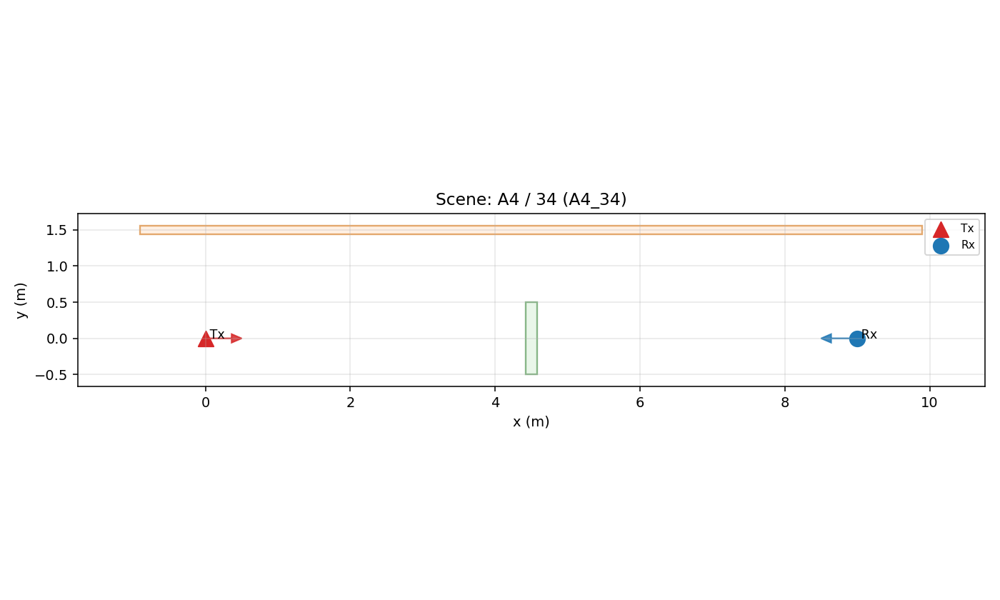

| XPD_early_excess_db | XPD_late_excess_db | L_pol_db | EL_proxy_db | LOSflag |
| --- | --- | --- | --- | --- |
| -26.82 | -24.93 | -1.885 | 10.16 | 0 |

Top rays

| rank | ray_index | n_bounce | P_lin | tau_ns | los_flag_ray | material_class |
| --- | --- | --- | --- | --- | --- | --- |
| 1 | 0 | 1 | 9.522e-09 | 31.64 | 0 | 1 |

